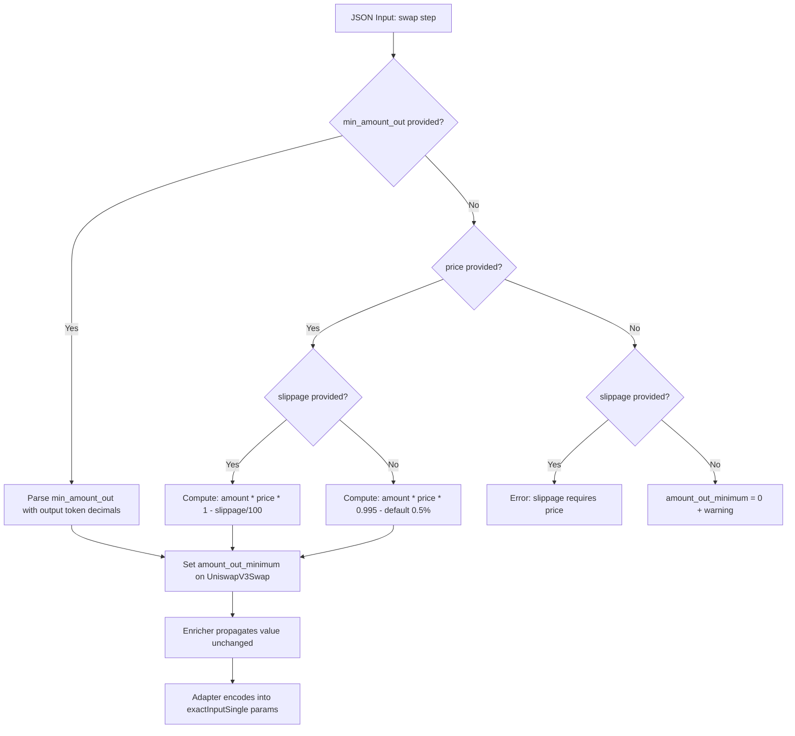

# Add Slippage / Min Amount Out to Uniswap Swaps

## Problem

The compiler currently hardcodes `amount_out_minimum: U256::ZERO` for all Uniswap V3 swaps (`normalize.rs:248`). This means **zero slippage protection** — the swap will succeed regardless of how unfavorable the price is. Users are vulnerable to sandwich attacks and price manipulation.

## Scope

- **Uniswap swaps only** — these are batched swaps executed via the `IntentRouter` contract.
- **1inch swaps are excluded** — they use pre-fetched calldata passthrough; slippage is handled by the 1inch Fusion protocol, not by the router contract.

## Design

Two complementary mechanisms for specifying minimum output:

### Option A: `min_amount_out` (explicit absolute value)
The frontend fetches a quote from Uniswap, computes the minimum acceptable output, and passes it directly. This is the most precise approach.

```json
{ "swap": { "from": "USDC", "amount": "1000", "to": "WETH", "min_amount_out": "0.48" } }
```

### Option B: `slippage` + `price` (percentage-based)
The frontend provides the current market price (output per input token) and an optional slippage tolerance. The compiler computes: `min_amount_out = amount_in × price × (1 - slippage / 100)`.

```json
{ "swap": { "from": "USDC", "amount": "1000", "to": "WETH", "price": "0.0005", "slippage": "0.5" } }
```

- `price` = expected output tokens per 1 input token (e.g., 1 USDC → 0.0005 WETH)
- `slippage` = max acceptable deviation as percentage (default: **0.5%** when `price` is provided but `slippage` is omitted)

### Precedence Rules

| `min_amount_out` | `price` | `slippage` | Behavior |
|---|---|---|---|
| ✅ provided | — | — | Use `min_amount_out` directly |
| ❌ | ✅ provided | ✅ provided | Compute: `amount × price × (1 - slippage/100)` |
| ❌ | ✅ provided | ❌ | Compute with default 0.5%: `amount × price × 0.995` |
| ❌ | ❌ | ✅ provided | **Error**: slippage requires price |
| ❌ | ❌ | ❌ | `amount_out_minimum = 0` + compiler **warning** |

If both `min_amount_out` and `price`/`slippage` are provided, `min_amount_out` takes precedence.

## Files to Modify

### 1. `crates/intent-script/src/schema/public_ast.rs` — Add fields to `SwapStep`

Add three optional fields to `SwapStep`:

```rust
pub struct SwapStep {
    pub from: String,
    pub amount: String,
    pub to: String,
    #[serde(default)]
    pub fee: Option<String>,
    #[serde(default)]
    pub via: Option<String>,
    #[serde(default)]
    pub calldata: Option<String>,
    // NEW:
    /// Explicit minimum output amount (human-readable, in output token units).
    /// Takes precedence over slippage+price calculation.
    #[serde(default)]
    pub min_amount_out: Option<String>,
    /// Current market price: output tokens per 1 input token.
    /// Required when slippage is specified without min_amount_out.
    #[serde(default)]
    pub price: Option<String>,
    /// Max slippage tolerance as percentage (e.g., "0.5" = 0.5%).
    /// Default: 0.5% when price is provided. Requires price field.
    #[serde(default)]
    pub slippage: Option<String>,
}
```

### 2. `crates/intent-script/src/compiler/normalize.rs` — Compute `amount_out_minimum`

In the `Step::Swap` → `"uniswap"` branch (around line 240-249), replace the hardcoded `U256::ZERO` with slippage-aware computation:

```rust
// Compute amount_out_minimum from slippage params
let amount_out_minimum = compute_amount_out_minimum(
    s,
    amount_in,
    &s.to,
    registry,
    &mut warnings,  // need to thread warnings through
)?;
```

Add a helper function `compute_amount_out_minimum`:
- If `min_amount_out` is provided: parse it using the output token's decimals → return as U256
- If `price` is provided: parse price as f64, parse slippage as f64 (default 0.5), compute `amount_in_f64 * price * (1 - slippage/100)`, convert to U256 with output token decimals
- If `slippage` is provided without `price`: return error
- If neither: return `U256::ZERO` and push a warning

**Threading warnings:** Currently `normalize()` doesn't return warnings. We need to either:
- (a) Add a `warnings: &mut Vec<String>` parameter to `normalize_step` and `normalize`, or
- (b) Return `(ResolvedIntent, Vec<String>)` from `normalize`

Option (a) is simpler and consistent with how `validate` works.

### 3. `crates/intent-script/src/compiler/mod.rs` — Merge normalize warnings

Update the `compile()` function to collect warnings from normalization and merge them with validation warnings.

### 4. `crates/intent-script/src/error.rs` — (Optional) Add error variant

May need a new error variant for "slippage requires price" if not covered by existing variants.

### 5. Example JSON files — Update

Update `examples/swap_uniswap.json`:
```json
{
  "network": "ethereum",
  "from": "0xd8dA6BF26964aF9D7eEd9e03E53415D37aA96045",
  "steps": [
    { "swap": { "from": "USDC", "amount": "1000", "to": "WETH", "min_amount_out": "0.48" } }
  ]
}
```

Add `examples/swap_uniswap_slippage.json`:
```json
{
  "network": "ethereum",
  "from": "0xd8dA6BF26964aF9D7eEd9e03E53415D37aA96045",
  "steps": [
    { "swap": { "from": "USDC", "amount": "1000", "to": "WETH", "price": "0.0005", "slippage": "1.0" } }
  ]
}
```

### 6. Tests — Add and update

#### 6a. Rust integration tests (`crates/intent-script/tests/integration.rs`)

**New tests:**
- `test_swap_with_min_amount_out` — explicit min output
- `test_swap_with_price_and_slippage` — percentage-based
- `test_swap_with_price_default_slippage` — price provided, slippage defaults to 0.5%
- `test_swap_slippage_without_price_fails` — error case
- `test_swap_no_slippage_warns` — warning when neither is provided
- `test_swap_min_amount_out_overrides_slippage` — precedence test

**Update existing tests**: Existing swap tests that don't provide slippage params should still compile (with a warning). No breaking changes.

#### 6b. Rust fixture generators

Update the fixture generators that produce swap calldata to include `min_amount_out` in the JSON input:
- `tests/generate_calldata.rs` — `generate_swap_usdc_weth_calldata`, `generate_swap_deposit_borrow_calldata`
- `tests/generate_eip712_fixtures.rs` — `generate_swap_usdc_weth_eip712`

These generators produce the `.txt` and `.json` fixture files that the Solidity E2E tests read. When `min_amount_out` is added to the example JSON, the generated calldata will include a non-zero `amountOutMinimum` in the `exactInputSingle` params.

#### 6c. Solidity E2E fork tests (`contracts/test/IntentForkE2E.t.sol`)

These tests run against a mainnet fork and use compiler-generated calldata fixtures.

**Fixture-based tests (auto-updated when fixtures are regenerated):**
- `test_fork_swapUSDC_WETH` (line 166) — reads `swap_usdc_weth.txt`. The fixture will now contain a non-zero `amountOutMinimum`. The test assertions (`wethAfter > wethBefore`) still hold since the swap output will exceed the minimum. **No code changes needed** — just regenerate fixtures.
- `test_fork_complexDefi_executeDirect` (line 311) — reads `complex_defi.txt`. Same as above — regenerate fixtures.

**Manually-constructed test (needs code update):**
- `test_fork_complexDefi_executeSigned` (line 446) — calls `_buildComplexDefiCalls()` which manually constructs the `exactInputSingle` calldata with `uint256(0)` for `amountOutMinimum` (line 406). This should be updated to use a realistic `min_amount_out` value to match what the compiler would produce.

**In `_buildComplexDefiCalls()` (line 372):** Update the swap call construction at line 401-409 to use a non-zero `amountOutMinimum`. Since this is a fork test against real Uniswap, we can use a conservative value (e.g., `1 wei` or a realistic minimum based on the swap amount).

#### 6d. Solidity mock-based tests (`contracts/test/IntentForkTests.t.sol`)

These use `MockSwapRouter` and manually construct swap calls:
- `test_swapUSDCtoWETH_throughRouter` (line 68) — uses `amountOutMinimum: 0` at line 110
- `test_swapDepositBorrow_throughRouter` (line 205) — uses `amountOutMinimum: 0`
- `test_swapAndStake_throughRouter` (line 338) — uses `amountOutMinimum: 0`

These should be updated to use non-zero `amountOutMinimum` values to match the new compiler behavior. The `MockSwapRouter` may need to be checked to ensure it respects `amountOutMinimum` (or at least doesn't break with non-zero values).

#### 6e. Solidity calldata decode tests (`contracts/test/IntentRouterCalldata.t.sol`)

- `test_executeCompilerCalldata_swapUSDCtoWETH_decodesCorrectly` (line 112) — reads fixture and decodes. Will automatically pick up new `amountOutMinimum` when fixtures are regenerated. May need assertion updates if the test checks specific field values.
- `test_executeCompilerCalldata_swapDepositBorrow_decodesCorrectly` (line 148) — same as above.

### 7. `plans/architecture.md` — Update documentation

Update the JSON schema section and the `SwapStep` documentation to reflect the new fields.

## Data Flow



## What Does NOT Change

- **`ResolvedStep::UniswapV3Swap`** IR — already has `amount_out_minimum: U256` field
- **`uniswap_v3.rs` adapter** — already passes `amount_out_minimum` through to ABI encoding
- **`enrich.rs`** — already propagates `amount_out_minimum` when cloning swap steps
- **`IntentRouter.sol`** — no changes needed (it just forwards calldata)
- **1inch swaps** — completely unaffected
- **All non-swap steps** — completely unaffected

## Precision Considerations

When computing `amount_out_minimum` from `price` + `slippage`:
- Parse `price` and `slippage` as `f64` for the multiplication
- Apply output token decimals when converting to `U256`
- Use floor rounding (conservative — slightly lower minimum protects the user)
- Formula: `floor(amount_in_human * price * (1 - slippage/100) * 10^output_decimals)`
