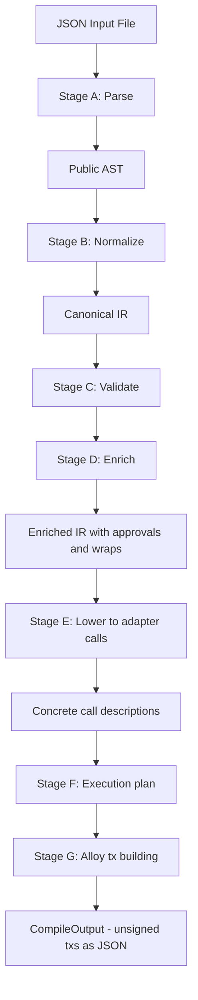

# Intent-Script v1 Architecture Plan

## Overview

A minimal JSON DSL compiler that takes human-friendly intent descriptions and produces unsigned EVM transactions using Alloy. The compiler is the "complexity sink" — it hides protocol details, token addresses, decimals, approvals, and calldata generation from the JSON input.

## v1 Scope

**Input**: A JSON file describing a linear sequence of DeFi actions using friendly aliases.  
**Output**: A JSON array of unsigned `TransactionRequest` objects ready for EOA signing.

### v1 Supported Actions
- `wrap` — ETH → WETH (primary end-to-end example)
- `unwrap` — WETH → ETH
- `deposit` — Aave V3 supply (with auto-inserted approval tx)

### v1 Target Network
- Ethereum mainnet (chain ID 1), hardcoded registry data

---

## Public JSON Schema (LLM-facing)

```json
{
  "network": "ethereum",
  "from": "0xYourEOA",
  "steps": [
    { "wrap": { "asset": "ETH", "amount": "1.5" } },
    { "deposit": { "asset": "WETH", "amount": "1.5", "into": "aave" } }
  ]
}
```

### Design Principles
- Aliases over addresses (`"ETH"`, `"USDC"`, `"aave"`)
- Human-readable amounts as strings (`"1.5"`, `"10000"`, `"all"`)
- Sequential steps — compiler infers dependencies
- Minimal required keys per action
- No ABI, calldata, addresses, or decimals in the JSON

---

## Compiler Pipeline



---

## Module Layout

```
src/
├── main.rs                    # CLI entry point
├── lib.rs                     # Public API: compile fn
├── schema/
│   ├── mod.rs
│   └── public_ast.rs          # Serde types for JSON input
├── ir/
│   ├── mod.rs
│   └── canonical.rs           # Resolved IR types with addresses and U256 amounts
├── registry/
│   ├── mod.rs
│   ├── chain.rs               # ChainRegistry: network alias → chain ID
│   ├── asset.rs               # AssetRegistry: token alias → address + decimals
│   └── protocol.rs            # ProtocolRegistry: protocol alias → deployment addresses
├── compiler/
│   ├── mod.rs                 # Top-level compile pipeline
│   ├── normalize.rs           # Stage B: AST → canonical IR
│   ├── validate.rs            # Stage C: IR validation
│   ├── enrich.rs              # Stage D: insert approvals, wraps
│   ├── lower.rs               # Stage E: IR → concrete call descriptions
│   ├── plan.rs                # Stage F: execution strategy
│   └── build.rs               # Stage G: Alloy TransactionRequest building
├── adapters/
│   ├── mod.rs                 # Adapter trait definition
│   ├── wrap.rs                # WETH deposit/withdraw adapter
│   ├── erc20.rs               # ERC-20 approve adapter
│   └── aave_v3.rs             # Aave V3 supply/borrow adapter
├── output.rs                  # CompileOutput types and JSON serialization
└── error.rs                   # Error types
```

---

## Key Types

### Public AST (`schema/public_ast.rs`)

```rust
#[derive(Deserialize)]
pub struct IntentScript {
    pub network: String,
    pub from: String,
    pub steps: Vec<Step>,
}

#[derive(Deserialize)]
#[serde(rename_all = "snake_case")]
pub enum Step {
    Swap(SwapStep),
    Deposit(DepositStep),
    Borrow(BorrowStep),
    Withdraw(WithdrawStep),
    Wrap(WrapStep),
    Unwrap(UnwrapStep),
    Custom(serde_json::Value),
}

#[derive(Deserialize)]
pub struct WrapStep {
    pub asset: String,
    pub amount: String,
}

#[derive(Deserialize)]
pub struct DepositStep {
    pub asset: String,
    pub amount: String,
    pub into: String,
}
// ... etc for each step type
```

### Canonical IR (`ir/canonical.rs`)

```rust
pub struct ResolvedIntent {
    pub chain_id: u64,
    pub signer: Address,
    pub steps: Vec<ResolvedStep>,
}

pub enum ResolvedStep {
    Wrap { amount: U256 },
    Unwrap { amount: U256 },
    Erc20Approve { token: Address, spender: Address, amount: U256 },
    AaveV3Supply { asset: Address, amount: U256, on_behalf_of: Address },
    AaveV3Borrow { asset: Address, amount: U256, rate_mode: u8, on_behalf_of: Address },
    // Swap, Withdraw, Custom — added later
}
```

### Concrete Call Description

```rust
pub struct ConcreteCall {
    pub to: Address,
    pub calldata: Bytes,
    pub value: U256,
    pub description: String,  // human-readable label for the tx
}
```

### Compile Output (`output.rs`)

```rust
pub enum CompileOutput {
    SingleTx(UnsignedTx),
    TxSequence(Vec<UnsignedTx>),
    RequiresExecutor { reason: String },
}

pub struct UnsignedTx {
    pub to: Address,
    pub data: Bytes,
    pub value: U256,
    pub chain_id: u64,
    pub from: Address,
    pub description: String,
}
```

---

## Registries (JSON Config Files)

Registries are loaded from JSON config files at runtime, making it easy to add new chains, tokens, and protocols without recompiling. The config files live in a `config/` directory at the project root.

### Config File Structure

```
config/
├── chains.json          # Network aliases → chain metadata
├── assets/
│   ├── ethereum.json    # Token aliases → addresses + decimals for chain ID 1
│   └── sepolia.json     # Token aliases for Sepolia testnet
└── protocols/
    ├── ethereum.json    # Protocol aliases → deployment addresses for chain ID 1
    └── sepolia.json     # Protocol aliases for Sepolia
```

### `config/chains.json`

Maps network aliases to chain metadata.

```json
{
  "ethereum": {
    "chain_id": 1,
    "native_asset": "ETH",
    "wrapped_native": "WETH"
  },
  "sepolia": {
    "chain_id": 11155111,
    "native_asset": "ETH",
    "wrapped_native": "WETH"
  },
  "base": {
    "chain_id": 8453,
    "native_asset": "ETH",
    "wrapped_native": "WETH"
  },
  "arbitrum": {
    "chain_id": 42161,
    "native_asset": "ETH",
    "wrapped_native": "WETH"
  }
}
```

### `config/assets/ethereum.json`

Maps token aliases to addresses and decimals for a specific chain. One file per chain.

```json
{
  "ETH": {
    "address": "native",
    "decimals": 18
  },
  "WETH": {
    "address": "0xC02aaA39b223FE8D0A0e5C4F27eAD9083C756Cc2",
    "decimals": 18
  },
  "USDC": {
    "address": "0xA0b86991c6218b36c1d19D4a2e9Eb0cE3606eB48",
    "decimals": 6
  },
  "USDT": {
    "address": "0xdAC17F958D2ee523a2206206994597C13D831ec7",
    "decimals": 6
  },
  "DAI": {
    "address": "0x6B175474E89094C44Da98b954EedeAC495271d0F",
    "decimals": 18
  },
  "WBTC": {
    "address": "0x2260FAC5E5542a773Aa44fBCfeDf7C193bc2C599",
    "decimals": 8
  }
}
```

### `config/protocols/ethereum.json`

Maps protocol aliases to their deployment addresses and metadata for a specific chain.

```json
{
  "aave": {
    "type": "lending",
    "version": "v3",
    "contracts": {
      "pool": "0x87870Bca3F3fD6335C3F4ce8392D69350B4fA4E2"
    }
  }
}
```

### Registry Loading

The compiler loads config files based on the `network` field in the intent JSON:

1. Parse `chains.json` → find chain metadata for the network alias
2. Load `assets/{network}.json` → build asset lookup table
3. Load `protocols/{network}.json` → build protocol lookup table

The registry loader returns a `RegistryContext` struct that the normalizer and adapters use:

```rust
pub struct RegistryContext {
    pub chain: ChainConfig,
    pub assets: HashMap<String, AssetConfig>,
    pub protocols: HashMap<String, ProtocolConfig>,
}
```

### Config file resolution

The CLI accepts an optional `--config-dir` flag. Default: `./config/`.

---

## Adapter Trait

```rust
pub trait Adapter {
    /// Lower a resolved step into one or more concrete calls
    fn lower(&self, step: &ResolvedStep, context: &CompileContext) -> Result<Vec<ConcreteCall>>;
}
```

Each adapter encapsulates ABI encoding for its protocol. v1 adapters:

1. **WrapAdapter** — calls `WETH.deposit{value: amount}()` (empty calldata + ETH value)
2. **UnwrapAdapter** — calls `WETH.withdraw(amount)`
3. **Erc20ApproveAdapter** — calls `token.approve(spender, amount)`
4. **AaveV3SupplyAdapter** — calls `pool.supply(asset, amount, onBehalfOf, 0)`

---

## End-to-End Example: Wrap ETH → WETH

### Input JSON
```json
{
  "network": "ethereum",
  "from": "0xd8dA6BF26964aF9D7eEd9e03E53415D37aA96045",
  "steps": [
    { "wrap": { "asset": "ETH", "amount": "1.5" } }
  ]
}
```

### Pipeline Trace

1. **Parse** → `IntentScript { network: "ethereum", from: "0xd8dA...", steps: [Wrap { asset: "ETH", amount: "1.5" }] }`
2. **Normalize** → `ResolvedIntent { chain_id: 1, signer: 0xd8dA..., steps: [Wrap { amount: 1_500_000_000_000_000_000 }] }`
3. **Validate** → OK (ETH exists on ethereum, amount parses)
4. **Enrich** → No changes needed (wrap doesnt need approval)
5. **Lower** → `ConcreteCall { to: WETH_ADDRESS, calldata: 0xd0e30db0 (deposit selector), value: 1.5 ETH }`
6. **Plan** → `SingleTx`
7. **Build** → Alloy `TransactionRequest`

### Output JSON
```json
{
  "type": "single_tx",
  "transactions": [
    {
      "to": "0xC02aaA39b223FE8D0A0e5C4F27eAD9083C756Cc2",
      "data": "0xd0e30db0",
      "value": "1500000000000000000",
      "chain_id": 1,
      "from": "0xd8dA6BF26964aF9D7eEd9e03E53415D37aA96045",
      "description": "Wrap 1.5 ETH to WETH"
    }
  ]
}
```

---

## End-to-End Example: Aave V3 Deposit (Multi-Tx)

### Input JSON
```json
{
  "network": "ethereum",
  "from": "0xd8dA6BF26964aF9D7eEd9e03E53415D37aA96045",
  "steps": [
    { "deposit": { "asset": "USDC", "amount": "5000", "into": "aave" } }
  ]
}
```

### Pipeline Trace

1. **Parse** → `DepositStep { asset: "USDC", amount: "5000", into: "aave" }`
2. **Normalize** → `AaveV3Supply { asset: USDC_ADDR, amount: 5_000_000_000 (6 decimals), on_behalf_of: signer }`
3. **Validate** → OK
4. **Enrich** → Inserts `Erc20Approve { token: USDC, spender: AAVE_POOL, amount: 5_000_000_000 }` before the supply step
5. **Lower** → Two `ConcreteCall`s: approve + supply
6. **Plan** → `TxSequence` (EOA cannot batch)
7. **Build** → Two Alloy `TransactionRequest`s

### Output JSON
```json
{
  "type": "tx_sequence",
  "transactions": [
    {
      "to": "0xA0b86991c6218b36c1d19D4a2e9Eb0cE3606eB48",
      "data": "0x095ea7b3...encoded approve calldata...",
      "value": "0",
      "chain_id": 1,
      "from": "0xd8dA6BF26964aF9D7eEd9e03E53415D37aA96045",
      "description": "Approve 5000 USDC for Aave V3 Pool"
    },
    {
      "to": "0x87870Bca3F3fD6335C3F4ce8392D69350B4fA4E2",
      "data": "0x617ba037...encoded supply calldata...",
      "value": "0",
      "chain_id": 1,
      "from": "0xd8dA6BF26964aF9D7eEd9e03E53415D37aA96045",
      "description": "Supply 5000 USDC to Aave V3"
    }
  ]
}
```

---

## Dependencies (Cargo.toml)

```toml
[dependencies]
alloy = { version = "1.7.3", features = ["sol-types"] }
alloy-primitives = "1"
alloy-sol-types = "1"
serde = { version = "1", features = ["derive"] }
serde_json = "1"
thiserror = "2"
clap = { version = "4", features = ["derive"] }
```

---

## Implementation Order

1. **Foundation**: error types, registry structs, public AST types, canonical IR types
2. **Registries**: hardcoded chain/asset/protocol data for Ethereum mainnet
3. **Parser**: JSON → public AST (just serde deserialization)
4. **Normalizer**: public AST → canonical IR (alias resolution, amount parsing)
5. **Validator**: canonical IR validation
6. **Enricher**: insert approval steps where needed
7. **Adapter trait + WrapAdapter**: lower wrap step to concrete call
8. **Erc20ApproveAdapter**: lower approve to concrete call
9. **AaveV3SupplyAdapter**: lower supply to concrete call
10. **Execution planner**: decide SingleTx vs TxSequence
11. **Alloy tx builder**: concrete calls → TransactionRequest
12. **CompileOutput**: serialization to JSON
13. **CLI**: clap-based CLI reading intent file, printing output
14. **Tests**: wrap end-to-end, Aave deposit end-to-end

---

## Extensibility Notes

- Adding a new action type = add variant to `Step` enum + `ResolvedStep` enum + new adapter
- Adding a new network = add entries to all three registries
- Adding a new protocol = add to `ProtocolRegistry` + new adapter
- Swap adapter (future) = will need router ABI + routing logic, but same adapter trait
- Custom step (future) = pass-through to raw calldata or dynamic ABI encoding
- The adapter trait is the primary extension point — each protocol gets its own adapter
