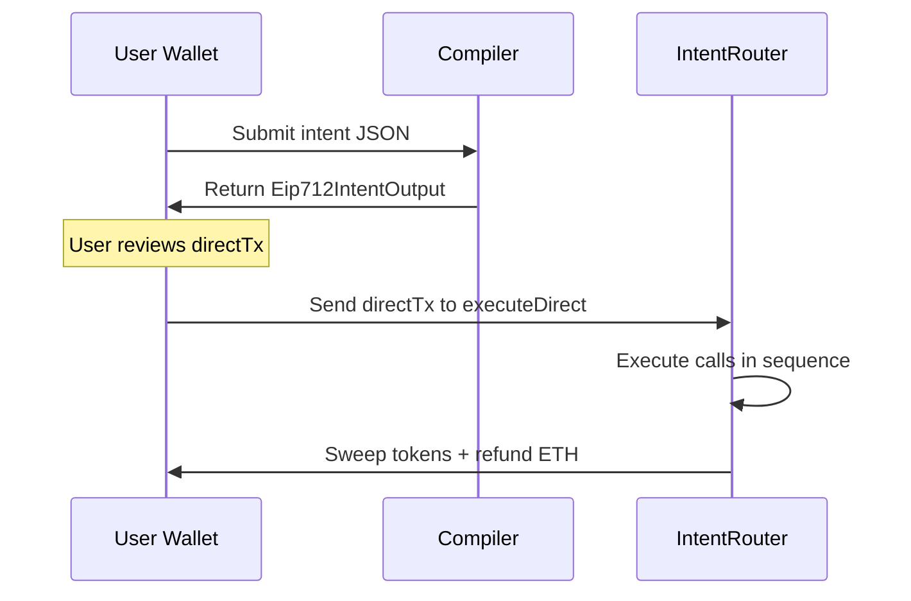
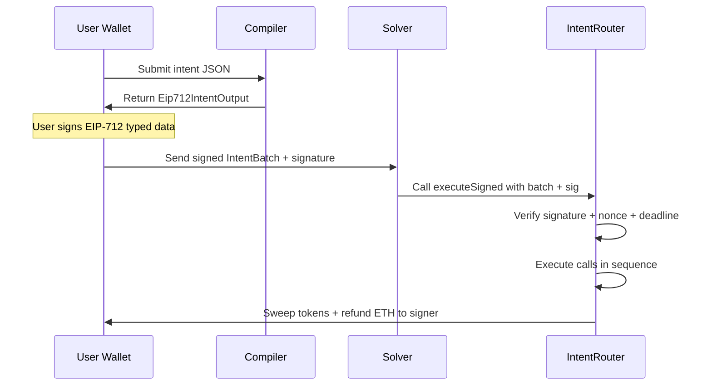

# Plan: EIP-712 Typed Signing & Router Upgrade

## Problem

The current compiler outputs raw calldata in [`output.rs`](../crates/intent-script/src/output.rs) as `UnsignedTx` structs. The user signs opaque bytes — their wallet shows a hex blob with no human-readable context. This is a poor UX and a security risk: users cannot verify what they are approving.

Additionally, the current [`IntentRouter.sol`](../contracts/src/IntentRouter.sol) uses `msg.sender` for authorization, meaning only the user themselves can submit the transaction. There is no way for a solver/relayer to execute on the user's behalf.

## Solution

Replace the raw calldata signing flow with **EIP-712 typed structured data**. The compiler outputs a typed hash struct that wallets render as human-readable fields. The router contract verifies an ECDSA signature over this struct, enabling two execution modes:

1. **Self-execute**: User signs the EIP-712 message and submits the tx directly to the router.
2. **Solver-execute**: User signs the EIP-712 message, hands the signature to a solver/relayer, who submits it on their behalf.

---

## EIP-712 Domain & Type Design

### Domain Separator

```solidity
EIP712Domain {
    name: "IntentRouter",
    version: "1",
    chainId: <chain_id>,
    verifyingContract: <router_address>
}
```

### Primary Type: `IntentBatch`

```solidity
struct IntentBatch {
    address signer;          // The EOA that authorizes this batch
    Call[] calls;            // Ordered array of sub-calls
    address[] tokensToSweep; // ERC-20 tokens to sweep back to signer
    uint256 nonce;           // Replay protection
    uint256 deadline;        // Expiry timestamp (0 = no expiry)
}

struct Call {
    address target;
    bytes callData;
    uint256 value;
}
```

### What the Wallet Displays

When the user signs, their wallet shows something like:

```
IntentRouter v1
Chain: Ethereum (1)

IntentBatch:
  signer: 0xd8dA...6045
  calls: [3 actions]
  tokensToSweep: [WETH]
  nonce: 7
  deadline: 1712345678
```

> **Note**: EIP-712 shows the struct field names and values. The `calls` array will show as encoded bytes — wallets vary in how deeply they render nested structs. The key improvement is that the user sees they are signing an `IntentBatch` with a known `signer`, `nonce`, and `deadline`, not opaque hex.

### Future Enhancement: Human-Readable Action Descriptions

For even better UX, we could add a `string description` field to the `IntentBatch` struct that summarizes the actions in plain English, e.g. `"Deposit 5000 USDC to Aave, Borrow 2000 DAI"`. This is a display-only field — the contract ignores it but wallets show it. This is out of scope for the MVP but is a natural extension.

---

## Router Contract Changes

### Current Contract

The current [`IntentRouter.sol`](../contracts/src/IntentRouter.sol:22) has a single function:

```solidity
function execute(Call[] calldata calls, address[] calldata tokensToSweep) external payable
```

This uses `msg.sender` for authorization and sweep destination.

### New Contract: `IntentRouterV2.sol`

```solidity
// SPDX-License-Identifier: MIT
pragma solidity ^0.8.20;

import {IERC20} from "./interfaces/IERC20.sol";

contract IntentRouter {
    // ─── EIP-712 ────────────────────────────────────────────
    bytes32 public constant DOMAIN_TYPEHASH = keccak256(
        "EIP712Domain(string name,string version,uint256 chainId,address verifyingContract)"
    );
    bytes32 public constant CALL_TYPEHASH = keccak256(
        "Call(address target,bytes callData,uint256 value)"
    );
    bytes32 public constant INTENT_BATCH_TYPEHASH = keccak256(
        "IntentBatch(address signer,Call[] calls,address[] tokensToSweep,uint256 nonce,uint256 deadline)Call(address target,bytes callData,uint256 value)"
    );

    bytes32 public immutable DOMAIN_SEPARATOR;

    mapping(address => uint256) public nonces;

    struct Call {
        address target;
        bytes callData;
        uint256 value;
    }

    struct IntentBatch {
        address signer;
        Call[] calls;
        address[] tokensToSweep;
        uint256 nonce;
        uint256 deadline;
    }

    constructor() {
        DOMAIN_SEPARATOR = keccak256(abi.encode(
            DOMAIN_TYPEHASH,
            keccak256("IntentRouter"),
            keccak256("1"),
            block.chainid,
            address(this)
        ));
    }

    // ─── Self-execute (user submits tx directly) ────────────
    function executeDirect(
        Call[] calldata calls,
        address[] calldata tokensToSweep
    ) external payable {
        _executeCalls(calls, msg.sender);
        _sweep(tokensToSweep, msg.sender);
        _refundETH(msg.sender);
    }

    // ─── Solver-execute (relayer submits on behalf of signer) ─
    function executeSigned(
        IntentBatch calldata batch,
        bytes calldata signature
    ) external payable {
        // Verify deadline
        require(batch.deadline == 0 || block.timestamp <= batch.deadline, "Expired");

        // Verify nonce
        require(batch.nonce == nonces[batch.signer], "Invalid nonce");
        nonces[batch.signer]++;

        // Verify EIP-712 signature
        bytes32 digest = _hashTypedData(batch);
        address recovered = _recover(digest, signature);
        require(recovered == batch.signer, "Invalid signature");

        // Execute
        _executeCalls(batch.calls, batch.signer);
        _sweep(batch.tokensToSweep, batch.signer);
        _refundETH(batch.signer);
    }

    // ─── Internal helpers ───────────────────────────────────

    function _executeCalls(Call[] calldata calls, address) internal {
        for (uint256 i = 0; i < calls.length; i++) {
            (bool success, bytes memory result) = calls[i].target.call{value: calls[i].value}(
                calls[i].callData
            );
            if (!success) {
                assembly { revert(add(result, 32), mload(result)) }
            }
        }
    }

    function _sweep(address[] calldata tokens, address recipient) internal {
        for (uint256 i = 0; i < tokens.length; i++) {
            uint256 balance = IERC20(tokens[i]).balanceOf(address(this));
            if (balance > 0) {
                bool success = IERC20(tokens[i]).transfer(recipient, balance);
                require(success, "Token sweep failed");
            }
        }
    }

    function _refundETH(address recipient) internal {
        uint256 ethBalance = address(this).balance;
        if (ethBalance > 0) {
            (bool sent,) = recipient.call{value: ethBalance}("");
            require(sent, "ETH refund failed");
        }
    }

    function _hashTypedData(IntentBatch calldata batch) internal view returns (bytes32) {
        return keccak256(abi.encodePacked(
            "\x19\x01",
            DOMAIN_SEPARATOR,
            _hashIntentBatch(batch)
        ));
    }

    function _hashIntentBatch(IntentBatch calldata batch) internal pure returns (bytes32) {
        return keccak256(abi.encode(
            INTENT_BATCH_TYPEHASH,
            batch.signer,
            _hashCalls(batch.calls),
            keccak256(abi.encodePacked(batch.tokensToSweep)),
            batch.nonce,
            batch.deadline
        ));
    }

    function _hashCalls(Call[] calldata calls) internal pure returns (bytes32) {
        bytes32[] memory hashes = new bytes32[](calls.length);
        for (uint256 i = 0; i < calls.length; i++) {
            hashes[i] = keccak256(abi.encode(
                CALL_TYPEHASH,
                calls[i].target,
                keccak256(calls[i].callData),
                calls[i].value
            ));
        }
        return keccak256(abi.encodePacked(hashes));
    }

    function _recover(bytes32 digest, bytes calldata sig) internal pure returns (address) {
        require(sig.length == 65, "Invalid signature length");
        bytes32 r;
        bytes32 s;
        uint8 v;
        assembly {
            r := calldataload(sig.offset)
            s := calldataload(add(sig.offset, 32))
            v := byte(0, calldataload(add(sig.offset, 64)))
        }
        return ecrecover(digest, v, r, s);
    }

    receive() external payable {}
}
```

### Key Design Decisions

1. **Two entry points**: `executeDirect` for self-execution (no signature needed, uses `msg.sender`), `executeSigned` for solver/relayer execution (requires EIP-712 signature).

2. **Nonce-based replay protection**: Each signer has an incrementing nonce. The compiler must fetch the current nonce when building the EIP-712 struct.

3. **Deadline**: Optional expiry timestamp. Set to 0 for no expiry.

4. **Sweep destination**: Always the `signer` address (not `msg.sender`), so the solver cannot steal tokens.

5. **No OpenZeppelin dependency**: Inline ECDSA recovery to keep the contract minimal and dependency-free for the MVP.

---

## Compiler Changes

### New Output Type

The compiler currently outputs [`CompileOutput`](../crates/intent-script/src/output.rs:8) with `UnsignedTx` variants. We need a new output variant for EIP-712 signing:

```rust
pub enum CompileOutput {
    /// Direct execution — user submits tx themselves
    DirectTx(UnsignedTx),
    /// EIP-712 typed data for signing — can be self-executed or solver-executed
    Eip712Intent(Eip712IntentOutput),
}

pub struct Eip712IntentOutput {
    /// The EIP-712 domain
    pub domain: Eip712Domain,
    /// The IntentBatch struct to sign
    pub intent_batch: IntentBatchData,
    /// Pre-computed EIP-712 typed data hash (for convenience)
    pub typed_data_hash: [u8; 32],
    /// Human-readable description of the batch
    pub description: String,
    /// The unsigned tx for self-execution (calls executeDirect)
    pub direct_tx: UnsignedTx,
}

pub struct Eip712Domain {
    pub name: String,
    pub version: String,
    pub chain_id: u64,
    pub verifying_contract: Address,
}

pub struct IntentBatchData {
    pub signer: Address,
    pub calls: Vec<CallData>,
    pub tokens_to_sweep: Vec<Address>,
    pub nonce: u64,
    pub deadline: u64,
}

pub struct CallData {
    pub target: Address,
    pub call_data: Bytes,
    pub value: U256,
}
```

### Pipeline Changes

The compiler pipeline in [`compiler/mod.rs`](../crates/intent-script/src/compiler/mod.rs:23) changes at the **Build** stage:

```
Parse → Normalize → Validate → Enrich → Lower → Plan → Build
                                                         ↓
                                              ┌──────────┴──────────┐
                                              │                     │
                                         SingleCall            BatchedCalls
                                              │                     │
                                         DirectTx            Eip712IntentOutput
                                                              (includes DirectTx
                                                               for self-execute)
```

**Key change**: When the plan is `Batched`, the build stage now produces an `Eip712IntentOutput` instead of encoding `router.execute()` calldata directly. The output includes:

1. The EIP-712 typed data (for wallet signing)
2. A pre-built `DirectTx` that calls `executeDirect()` (for self-execution without signature)

### Files to Modify

| File | Change |
|------|--------|
| [`output.rs`](../crates/intent-script/src/output.rs) | Add `Eip712IntentOutput`, `Eip712Domain`, `IntentBatchData`, `CallData` types and JSON serialization |
| [`compiler/build.rs`](../crates/intent-script/src/compiler/build.rs) | Handle `Batched` plan → produce `Eip712IntentOutput` with both EIP-712 data and direct tx |
| [`compiler/mod.rs`](../crates/intent-script/src/compiler/mod.rs) | Pass router address to build stage for domain construction |
| [`contracts/src/IntentRouter.sol`](../contracts/src/IntentRouter.sol) | Replace with new contract supporting `executeDirect` + `executeSigned` |
| [`contracts/test/IntentRouter.t.sol`](../contracts/test/IntentRouter.t.sol) | Update tests for new contract interface |
| [`contracts/test/IntentRouterCalldata.t.sol`](../contracts/test/IntentRouterCalldata.t.sol) | Update fixture tests for new calldata format |

### New Files

| File | Purpose |
|------|---------|
| `crates/intent-script/src/eip712.rs` | EIP-712 hashing logic (domain separator, struct hashing) |

---

## JSON Output Format

The compiler's JSON output for an EIP-712 intent:

```json
{
  "type": "eip712_intent",
  "eip712": {
    "domain": {
      "name": "IntentRouter",
      "version": "1",
      "chainId": 1,
      "verifyingContract": "0x..."
    },
    "primaryType": "IntentBatch",
    "types": {
      "EIP712Domain": [
        { "name": "name", "type": "string" },
        { "name": "version", "type": "string" },
        { "name": "chainId", "type": "uint256" },
        { "name": "verifyingContract", "type": "address" }
      ],
      "Call": [
        { "name": "target", "type": "address" },
        { "name": "callData", "type": "bytes" },
        { "name": "value", "type": "uint256" }
      ],
      "IntentBatch": [
        { "name": "signer", "type": "address" },
        { "name": "calls", "type": "Call[]" },
        { "name": "tokensToSweep", "type": "address[]" },
        { "name": "nonce", "type": "uint256" },
        { "name": "deadline", "type": "uint256" }
      ]
    },
    "message": {
      "signer": "0xd8dA6BF26964aF9D7eEd9e03E53415D37aA96045",
      "calls": [
        {
          "target": "0xA0b86991c6218b36c1d19D4a2e9Eb0cE3606eB48",
          "callData": "0x095ea7b3...",
          "value": "0"
        },
        {
          "target": "0x87870Bca3F3fD6335C3F4ce8392D69350B4fA4E2",
          "callData": "0x617ba037...",
          "value": "0"
        }
      ],
      "tokensToSweep": [],
      "nonce": "0",
      "deadline": "0"
    }
  },
  "directTx": {
    "to": "0x...",
    "data": "0x...",
    "value": "0",
    "chainId": 1,
    "from": "0xd8dA6BF26964aF9D7eEd9e03E53415D37aA96045",
    "description": "Batched via router: [Approve USDC, Supply to Aave V3]"
  },
  "description": "Deposit 5000 USDC to Aave V3"
}
```

This format is directly compatible with `eth_signTypedData_v4` — a frontend can pass the `eip712` object directly to MetaMask/WalletConnect.

---

## Execution Flows

### Flow 1: User Self-Executes



### Flow 2: Solver Executes



---

## Nonce Management

The compiler needs the current nonce for the signer to build the EIP-712 struct. Two approaches:

### MVP Approach: Nonce as Input

The simplest approach — the caller provides the nonce:

```json
{
  "network": "ethereum",
  "from": "0xd8dA...",
  "nonce": 0,
  "deadline": 0,
  "steps": [...]
}
```

The compiler includes `nonce` and `deadline` in the `IntentBatch`. If omitted, defaults to `nonce: 0, deadline: 0`.

### Future: On-Chain Nonce Lookup

The compiler could query the router contract for `nonces(signer)` via an RPC call. This requires adding an RPC provider to the compiler, which is out of scope for the MVP.

---

## Migration Strategy

1. **Keep backward compatibility**: The `executeDirect` function is functionally identical to the current `execute` function (just renamed). Existing tests that use `execute` can be updated to use `executeDirect` with minimal changes.

2. **Rename the contract file**: Replace [`IntentRouter.sol`](../contracts/src/IntentRouter.sol) in-place. The contract name stays `IntentRouter`.

3. **Update all Foundry tests**: Change `execute(` → `executeDirect(` in existing tests, then add new tests for `executeSigned`.

4. **Update compiler build stage**: The [`build()`](../crates/intent-script/src/compiler/build.rs:22) function produces `Eip712IntentOutput` for batched plans.

---

## Test Plan

### Solidity Tests

1. **`test_executeDirect_wrapETH`** — Same as current wrap test but using `executeDirect`
2. **`test_executeDirect_batchedCalls`** — Multi-call batch via `executeDirect`
3. **`test_executeSigned_validSignature`** — Sign EIP-712 data, submit via solver
4. **`test_executeSigned_invalidSignature`** — Reject bad signature
5. **`test_executeSigned_expiredDeadline`** — Reject expired batch
6. **`test_executeSigned_replayProtection`** — Same signature cannot be used twice
7. **`test_executeSigned_wrongNonce`** — Reject wrong nonce
8. **`test_executeSigned_sweepToSigner`** — Tokens go to signer, not msg.sender

### Rust Tests

1. **`test_eip712_output_format`** — Compiler produces valid EIP-712 JSON
2. **`test_eip712_domain_separator`** — Domain separator matches contract
3. **`test_eip712_struct_hash`** — Struct hash matches contract computation
4. **`test_direct_tx_included`** — Output includes a valid `directTx`
5. **`test_single_call_still_direct`** — Single-call intents still produce `DirectTx` (no EIP-712)
