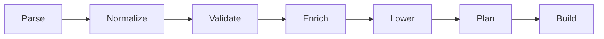
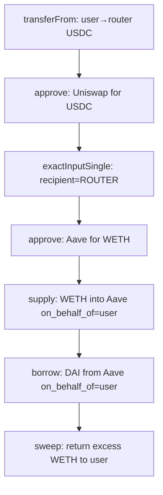

# Fix: Missing `transferFrom` in Batched Calldata

**Issue:** [plans/issues/missing-transferfrom-in-batched-calldata.md](issues/missing-transferfrom-in-batched-calldata.md)

## Problem Summary

When the compiler batches multiple calls through the `IntentRouter` via `executeDirect()`, it generates `approve` + protocol calls but does **not** generate a `transferFrom(user, router, amount)` call to first pull the user's ERC-20 tokens into the router. This causes all ERC-20-based fork E2E tests to revert.

## Architecture Context

The compiler pipeline is:



The bug is in **Stage D: Enrich** ([`enrich.rs`](../crates/intent-script/src/compiler/enrich.rs)). When a router is configured and the intent uses ERC-20 tokens, the enricher inserts `Erc20Approve` but never inserts a `transferFrom` to move tokens from the user to the router.

### Current flow for a batched swap — BROKEN

```
User → Router.executeDirect:
  1. approve Uniswap for USDC       ← router approves, but has no USDC
  2. exactInputSingle recipient=user ← Uniswap pulls USDC from router — FAILS
```

### Required flow — FIXED

```
User → Router.executeDirect:
  1. transferFrom user→router USDC   ← pull tokens from user into router
  2. approve Uniswap for USDC        ← router approves Uniswap
  3. exactInputSingle recipient=router ← Uniswap pulls from router, WETH stays in router
  4. sweep WETH back to user          ← router returns excess tokens
```

### Chained steps optimization

For multi-step intents like `complex_defi.json` — swap USDC→WETH, deposit WETH into Aave, borrow DAI — we need to keep intermediate tokens in the router to avoid requiring extra user approvals:



Key insight: when batching, swap `recipient` and similar output addresses should point to the **router** — not the signer — so intermediate tokens stay in the router. The enricher tracks which tokens are already in the router and skips `transferFrom` for those.

**Prerequisite:** The user must call `token.approve(router, amount)` externally for each token they provide as initial input. The fork E2E tests already do this.

## Implementation Plan

### Step 1: Add `Erc20TransferFrom` variant to `ResolvedStep`

**File:** [`crates/intent-script/src/ir/canonical.rs`](../crates/intent-script/src/ir/canonical.rs)

Add a new variant to the [`ResolvedStep`](../crates/intent-script/src/ir/canonical.rs:25) enum after `Erc20Approve` at line 41:

```rust
/// ERC-20 transferFrom (auto-inserted by enricher for router batching)
Erc20TransferFrom {
    token: Address,
    from: Address,
    to: Address,
    amount: U256,
},
```

### Step 2: Add `lower_transfer_from` adapter function

**File:** [`crates/intent-script/src/adapters/erc20.rs`](../crates/intent-script/src/adapters/erc20.rs)

Add to the existing [`sol!`](../crates/intent-script/src/adapters/erc20.rs:13) block:

```rust
function transferFrom(address from, address to, uint256 amount) external returns (bool);
```

Add a new lowering function after [`lower_approve`](../crates/intent-script/src/adapters/erc20.rs:19):

```rust
pub fn lower_transfer_from(step: &ResolvedStep) -> Result<Vec<ConcreteCall>> {
    let ResolvedStep::Erc20TransferFrom { token, from, to, amount } = step else {
        return Err(CompileError::Adapter("Expected Erc20TransferFrom step".to_string()));
    };

    let calldata = transferFromCall {
        from: *from,
        to: *to,
        amount: *amount,
    }.abi_encode();

    Ok(vec![ConcreteCall {
        to: *token,
        calldata: Bytes::from(calldata),
        value: U256::ZERO,
        description: format!(
            "TransferFrom {} wei of token {} from {} to {}",
            amount, token, from, to
        ),
    }])
}
```

### Step 3: Register dispatch in adapters `mod.rs`

**File:** [`crates/intent-script/src/adapters/mod.rs`](../crates/intent-script/src/adapters/mod.rs)

Add a match arm in [`lower_step`](../crates/intent-script/src/adapters/mod.rs:13) after the `Erc20Approve` arm:

```rust
ResolvedStep::Erc20TransferFrom { .. } => erc20::lower_transfer_from(step),
```

### Step 4: Update enricher — the core fix

**File:** [`crates/intent-script/src/compiler/enrich.rs`](../crates/intent-script/src/compiler/enrich.rs)

This is the most complex change. The enricher needs to:

1. **Track tokens in the router** — maintain a `HashSet<Address>` of tokens that are already in the router from previous steps
2. **Insert `transferFrom`** only for tokens NOT already in the router
3. **Redirect intermediate outputs to the router** — when batching, swap `recipient` and similar fields should point to the router so intermediate tokens stay there

#### 4a. Add router-aware token tracking

At the top of the [`enrich`](../crates/intent-script/src/compiler/enrich.rs:18) function, after getting the router:

```rust
let signer = intent.signer;
let mut tokens_in_router: std::collections::HashSet<Address> = std::collections::HashSet::new();
```

#### 4b. Update `UniswapV3Swap` arm (line 41-63)

When `router.is_some()`:
- Insert `transferFrom(signer, router, amount_in)` for `token_in` IF `token_in` is NOT in `tokens_in_router`
- Keep the `Erc20Approve` for the swap router
- **Clone the step and override `recipient` to `router_addr`** so output tokens stay in the router
- Add `token_out` to `tokens_in_router`
- Still add `token_out` to `sweep_tokens`

When `router.is_none()`:
- Keep existing behavior (just approve + swap)

```rust
ResolvedStep::UniswapV3Swap {
    router: swap_router, token_in, token_out, amount_in,
    fee, deadline, amount_out_minimum, ..
} => {
    if let Some(router_addr) = router {
        // Pull token_in from user if not already in router
        if !tokens_in_router.contains(token_in) {
            enriched_steps.push(ResolvedStep::Erc20TransferFrom {
                token: *token_in,
                from: signer,
                to: router_addr,
                amount: *amount_in,
            });
        }
        enriched_steps.push(ResolvedStep::Erc20Approve {
            token: *token_in,
            spender: *swap_router,
            amount: *amount_in,
        });
        // Redirect recipient to router so output stays in router
        enriched_steps.push(ResolvedStep::UniswapV3Swap {
            router: *swap_router,
            token_in: *token_in,
            token_out: *token_out,
            amount_in: *amount_in,
            fee: *fee,
            recipient: router_addr,
            deadline: *deadline,
            amount_out_minimum: *amount_out_minimum,
        });
        // Track output token as being in the router
        tokens_in_router.insert(*token_out);
        if !sweep_tokens.contains(token_out) {
            sweep_tokens.push(*token_out);
        }
    } else {
        enriched_steps.push(ResolvedStep::Erc20Approve {
            token: *token_in,
            spender: *swap_router,
            amount: *amount_in,
        });
        enriched_steps.push(step.clone());
    }
}
```

#### 4c. Update `AaveV3Supply` arm (line 25-39)

When `router.is_some()`:
- Insert `transferFrom` for `asset` IF NOT in `tokens_in_router`
- Keep the `Erc20Approve`
- Keep the step as-is (`on_behalf_of` stays as signer — Aave mints aTokens to user)

```rust
ResolvedStep::AaveV3Supply { pool, asset, amount, .. } => {
    if let Some(router_addr) = router {
        if !tokens_in_router.contains(asset) {
            enriched_steps.push(ResolvedStep::Erc20TransferFrom {
                token: *asset,
                from: signer,
                to: router_addr,
                amount: *amount,
            });
        }
    }
    enriched_steps.push(ResolvedStep::Erc20Approve {
        token: *asset,
        spender: *pool,
        amount: *amount,
    });
    enriched_steps.push(step.clone());
}
```

#### 4d. Update `WstETHWrap` arm (line 82-99)

When `router.is_some()`:
- Insert `transferFrom` for `steth` IF NOT in `tokens_in_router`
- Keep the `Erc20Approve`
- Track `wsteth` as being in the router after the wrap
- Keep sweep tracking

```rust
ResolvedStep::WstETHWrap { wsteth, steth, amount } => {
    if let Some(router_addr) = router {
        if !tokens_in_router.contains(steth) {
            enriched_steps.push(ResolvedStep::Erc20TransferFrom {
                token: *steth,
                from: signer,
                to: router_addr,
                amount: *amount,
            });
        }
    }
    enriched_steps.push(ResolvedStep::Erc20Approve {
        token: *steth,
        spender: *wsteth,
        amount: *amount,
    });
    enriched_steps.push(step.clone());

    if router.is_some() {
        tokens_in_router.insert(*wsteth);
        if !sweep_tokens.contains(wsteth) {
            sweep_tokens.push(*wsteth);
        }
    }
}
```

#### 4e. Update `OneInchSwap` arm (line 100-119)

Same pattern as `UniswapV3Swap`:
- Insert `transferFrom` for `token_in` if not in router
- Track `token_out` as in router
- Note: 1inch calldata is pre-built, so we can't change the recipient. The 1inch API should be called with the router as recipient. For now, insert `transferFrom` and keep existing behavior.

```rust
ResolvedStep::OneInchSwap {
    router: oneinch_router, token_in, token_out, amount_in, ..
} => {
    if let Some(router_addr) = router {
        if !tokens_in_router.contains(token_in) {
            enriched_steps.push(ResolvedStep::Erc20TransferFrom {
                token: *token_in,
                from: signer,
                to: router_addr,
                amount: *amount_in,
            });
        }
    }
    enriched_steps.push(ResolvedStep::Erc20Approve {
        token: *token_in,
        spender: *oneinch_router,
        amount: *amount_in,
    });
    enriched_steps.push(step.clone());

    if router.is_some() {
        tokens_in_router.insert(*token_out);
        if !sweep_tokens.contains(token_out) {
            sweep_tokens.push(*token_out);
        }
    }
}
```

#### 4f. Update `LidoStake` arm (line 64-72)

No `transferFrom` needed — uses native ETH. But when batching, track `stETH` as being in the router (the router receives stETH from Lido):

```rust
ResolvedStep::LidoStake { lido, .. } => {
    enriched_steps.push(step.clone());
    if router.is_some() {
        tokens_in_router.insert(*lido);
        if !sweep_tokens.contains(lido) {
            sweep_tokens.push(*lido);
        }
    }
}
```

#### 4g. Update `Wrap` arm (line 73-81)

No `transferFrom` needed — uses native ETH. Track wrapped token as in router:

```rust
ResolvedStep::Wrap { wrapped_token, .. } => {
    enriched_steps.push(step.clone());
    if router.is_some() {
        tokens_in_router.insert(*wrapped_token);
        if !sweep_tokens.contains(wrapped_token) {
            sweep_tokens.push(*wrapped_token);
        }
    }
}
```

### Step 5: Update fork E2E tests

**File:** [`contracts/test/IntentForkE2E.t.sol`](../contracts/test/IntentForkE2E.t.sol)

The fork E2E tests that use compiler-generated calldata (`test_fork_swapUSDC_WETH`, `test_fork_aaveDepositUSDC`, etc.) should work without changes because:
- The compiler now generates `transferFrom` calls
- The tests already approve the router for the initial input token
- Intermediate tokens stay in the router (no extra approvals needed)

The manually-built `_buildComplexDefiCalls` helper (line 342) and `test_fork_complexDefi_executeSigned` (line 394) need updating to include `transferFrom` calls and redirect swap recipient to the router. However, since `test_fork_complexDefi_executeSigned` builds calls manually (not from compiler output), it should be updated to match the new compiler output pattern:

1. Add `transferFrom(signer, router, USDC)` as the first call
2. Change swap `recipient` from `signer` to `address(signedRouter)`
3. Update the calls array size from 5 to 6

### Step 6: Update Rust integration tests

**File:** [`crates/intent-script/tests/integration.rs`](../crates/intent-script/tests/integration.rs)

Update [`test_aave_deposit_usdc_batched_through_router`](../crates/intent-script/tests/integration.rs:62) and similar tests to verify:
- The `intent_batch.calls` count includes the new `transferFrom` call
- The first call in a batch targeting ERC-20 tokens has the `transferFrom` selector (`0x23b872dd`)

### Step 7: Regenerate fixtures

Run `make generate-fixtures` to regenerate all fixture files with the new `transferFrom` calls and updated swap recipients.

### Step 8: Verify all tests pass

```bash
# Rust unit + integration tests
cargo test -p intent-script

# Regenerate fixtures
make generate-fixtures

# Foundry unit tests (mock-based)
cd contracts && forge test --mc IntentRouter -vvv

# Fork E2E tests
cd contracts && forge test --mc IntentForkE2E --fork-url https://ethereum-rpc.publicnode.com -vvv
```

## Files Modified

| File | Change |
|------|--------|
| [`crates/intent-script/src/ir/canonical.rs`](../crates/intent-script/src/ir/canonical.rs) | Add `Erc20TransferFrom` variant to `ResolvedStep` |
| [`crates/intent-script/src/adapters/erc20.rs`](../crates/intent-script/src/adapters/erc20.rs) | Add `transferFrom` sol! decl + `lower_transfer_from()` |
| [`crates/intent-script/src/adapters/mod.rs`](../crates/intent-script/src/adapters/mod.rs) | Add dispatch for `Erc20TransferFrom` |
| [`crates/intent-script/src/compiler/enrich.rs`](../crates/intent-script/src/compiler/enrich.rs) | Insert `transferFrom`, track router tokens, redirect recipients |
| [`crates/intent-script/tests/integration.rs`](../crates/intent-script/tests/integration.rs) | Update assertions for new call counts |
| [`contracts/test/IntentForkE2E.t.sol`](../contracts/test/IntentForkE2E.t.sol) | Update manually-built `executeSigned` test |
| `contracts/test/fixtures/*` | Regenerated by fixture generators |

## Call sequence examples after fix

### Simple swap: USDC → WETH

```
executeDirect:
  [0] transferFrom(user, router, 1000 USDC)   ← NEW
  [1] approve(Uniswap, 1000 USDC)
  [2] exactInputSingle(recipient=ROUTER)       ← CHANGED from user to router
  sweep: [WETH]
```

### Aave deposit: USDC

```
executeDirect:
  [0] transferFrom(user, router, 100 USDC)    ← NEW
  [1] approve(Aave, 100 USDC)
  [2] supply(USDC, on_behalf_of=user)
  sweep: []
```

### Complex DeFi: swap USDC→WETH + deposit WETH + borrow DAI

```
executeDirect:
  [0] transferFrom(user, router, 5000 USDC)   ← NEW
  [1] approve(Uniswap, 5000 USDC)
  [2] exactInputSingle(recipient=ROUTER)       ← CHANGED
  [3] approve(Aave, 2 WETH)                    ← no transferFrom needed, WETH in router
  [4] supply(WETH, on_behalf_of=user)
  [5] borrow(DAI, on_behalf_of=user)
  sweep: [WETH]                                ← excess WETH returned to user
```
