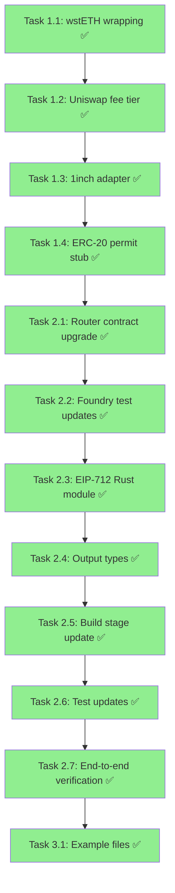

# Master Implementation Plan

This is the comprehensive, step-by-step implementation plan for upgrading the intent-script compiler. It is designed to be executed by an LLM in code mode, with each task being independently completable and testable.

**Reference documents:**
- [`plans/eip712-signing.md`](./eip712-signing.md) — EIP-712 typed signing & router upgrade design
- [`plans/protocol-adapters.md`](./protocol-adapters.md) — Protocol adapter completion design
- [`plans/architecture.md`](./architecture.md) — Original v1 architecture

**Guiding principles:**
- Each task should compile and pass tests before moving to the next
- Prefer small, focused changes over large refactors
- Keep backward compatibility where possible — existing tests should keep passing until explicitly updated
- The compiler is a pure, deterministic program — no HTTP calls, no async

---

## Phase 1: New Protocol Adapters (Low Risk, High Value)

These tasks extend the existing working pipeline without changing its structure. All existing tests continue to pass.

### Task 1.1: Add wstETH wrapping support

**Goal**: Support `{ "wrap": { "asset": "stETH", "amount": "10.0" } }` to wrap stETH → wstETH.

**Files to modify:**

1. **[`config/assets/ethereum.json`](../config/assets/ethereum.json)** — Add wstETH entry:
   ```json
   "wstETH": {
     "address": "0x7f39C581F595B53c5cb19bD0b3f8dA6c935E2Ca0",
     "decimals": 18
   }
   ```

2. **[`config/protocols/ethereum.json`](../config/protocols/ethereum.json)** — Add `wsteth` contract to lido:
   ```json
   "lido": {
     "type": "staking",
     "version": "v1",
     "contracts": {
       "steth": "0xae7ab96520DE3A18E5e111B5EaAb095312D7fE84",
       "wsteth": "0x7f39C581F595B53c5cb19bD0b3f8dA6c935E2Ca0"
     }
   }
   ```

3. **[`crates/intent-script/src/ir/canonical.rs`](../crates/intent-script/src/ir/canonical.rs)** — Add `WstETHWrap` variant to `ResolvedStep`:
   ```rust
   WstETHWrap {
       wsteth: Address,
       steth: Address,
       amount: U256,
   },
   ```

4. **[`crates/intent-script/src/compiler/normalize.rs`](../crates/intent-script/src/compiler/normalize.rs)** — In the `Step::Wrap` match arm, detect when `asset` is `"stETH"` and produce `ResolvedStep::WstETHWrap` instead of `ResolvedStep::Wrap`. Look up the wstETH address from the lido protocol config.

5. **[`crates/intent-script/src/compiler/enrich.rs`](../crates/intent-script/src/compiler/enrich.rs)** — Add a match arm for `WstETHWrap`:
   - Insert `Erc20Approve { token: steth, spender: wsteth, amount }` before the wrap
   - Track wstETH in `tokens_to_sweep` when router batching is active

6. **[`crates/intent-script/src/adapters/lido.rs`](../crates/intent-script/src/adapters/lido.rs)** — Add `lower_wsteth_wrap()` function that encodes `wstETH.wrap(uint256)` calldata using `alloy_sol_types::sol!`.

7. **[`crates/intent-script/src/adapters/mod.rs`](../crates/intent-script/src/adapters/mod.rs)** — Add dispatch for `ResolvedStep::WstETHWrap` → `lido::lower_wsteth_wrap`.

**Tests to add:**
- Integration test: `{ "wrap": { "asset": "stETH", "amount": "10.0" } }` compiles successfully
- Integration test: Two-step `stake ETH into lido` + `wrap stETH` produces batched calldata
- Verify calldata starts with correct function selector for `wrap(uint256)`

**Verification**: `cargo test -p intent-script` — all existing tests pass, new tests pass.

---

### Task 1.2: Add optional fee tier to Uniswap V3 swaps

**Goal**: Support `{ "swap": { "from": "USDC", "amount": "1000", "to": "WETH", "fee": "500" } }`.

**Files to modify:**

1. **[`crates/intent-script/src/schema/public_ast.rs`](../crates/intent-script/src/schema/public_ast.rs)** — Add optional `fee` field to `SwapStep`:
   ```rust
   #[serde(default)]
   pub fee: Option<String>,
   ```

2. **[`crates/intent-script/src/compiler/normalize.rs`](../crates/intent-script/src/compiler/normalize.rs)** — In the `Step::Swap` match arm, parse `fee` if provided (default to 3000):
   ```rust
   let fee: u32 = s.fee.as_deref().unwrap_or("3000").parse().map_err(|_| ...)?;
   ```

**Tests to add:**
- Integration test: Swap with `"fee": "500"` compiles and produces correct fee in calldata
- Integration test: Swap without `fee` still defaults to 3000

**Verification**: `cargo test -p intent-script` — all tests pass.

---

### Task 1.3: Add `via` field and 1inch swap adapter

**Goal**: Support `{ "swap": { "from": "USDC", "amount": "1000", "to": "WETH", "via": "1inch", "calldata": "0x..." } }`.

**Files to modify:**

1. **[`crates/intent-script/src/schema/public_ast.rs`](../crates/intent-script/src/schema/public_ast.rs)** — Add `via` and `calldata` fields to `SwapStep`:
   ```rust
   #[serde(default)]
   pub via: Option<String>,
   #[serde(default)]
   pub calldata: Option<String>,
   ```

2. **[`crates/intent-script/src/ir/canonical.rs`](../crates/intent-script/src/ir/canonical.rs)** — Add `OneInchSwap` variant:
   ```rust
   OneInchSwap {
       router: Address,
       token_in: Address,
       token_out: Address,
       amount_in: U256,
       calldata: Bytes,
   },
   ```

3. **[`config/protocols/ethereum.json`](../config/protocols/ethereum.json)** — Add 1inch protocol:
   ```json
   "1inch": {
     "type": "dex_aggregator",
     "version": "v6",
     "contracts": {
       "router": "0x111111125421cA6dc452d289314280a0f8842A65"
     }
   }
   ```

4. **[`crates/intent-script/src/compiler/normalize.rs`](../crates/intent-script/src/compiler/normalize.rs)** — In the `Step::Swap` match arm, check `via` field:
   - `None` or `"uniswap"` → existing `UniswapV3Swap` path
   - `"1inch"` → require `calldata` field, look up 1inch router from protocol config, produce `OneInchSwap`
   - Other → return `CompileError::UnsupportedStep`

5. **[`crates/intent-script/src/compiler/enrich.rs`](../crates/intent-script/src/compiler/enrich.rs)** — Add match arm for `OneInchSwap`:
   - Insert `Erc20Approve { token: token_in, spender: router, amount: amount_in }` before the swap
   - Track `token_out` in `tokens_to_sweep` when batching

6. **[`crates/intent-script/src/adapters/oneinch.rs`](../crates/intent-script/src/adapters/oneinch.rs)** — NEW FILE. Implement `lower_oneinch_swap()` that wraps the pre-fetched calldata into a `ConcreteCall`.

7. **[`crates/intent-script/src/adapters/mod.rs`](../crates/intent-script/src/adapters/mod.rs)** — Register `oneinch` module and add dispatch for `OneInchSwap`.

**Tests to add:**
- Integration test: Swap with `"via": "1inch"` and mock calldata compiles successfully
- Integration test: Swap with `"via": "1inch"` but missing `calldata` returns error
- Integration test: Swap without `via` still uses Uniswap V3

**Verification**: `cargo test -p intent-script` — all tests pass.

---

### Task 1.4: Add ERC-20 permit infrastructure (IR + adapter stub)

**Goal**: Add the `Erc20Permit` IR variant and adapter. Not wired into automatic enrichment yet.

**Files to modify:**

1. **[`crates/intent-script/src/ir/canonical.rs`](../crates/intent-script/src/ir/canonical.rs)** — Add `Erc20Permit` variant:
   ```rust
   Erc20Permit {
       token: Address,
       owner: Address,
       spender: Address,
       value: U256,
       deadline: U256,
   },
   ```

2. **[`crates/intent-script/src/adapters/erc20.rs`](../crates/intent-script/src/adapters/erc20.rs)** — Add `lower_permit()` function that encodes `permit(address,address,uint256,uint256,uint8,bytes32,bytes32)`. Note: at compile time, `v`, `r`, `s` are placeholder zeros — the frontend fills them after the user signs.

3. **[`crates/intent-script/src/adapters/mod.rs`](../crates/intent-script/src/adapters/mod.rs)** — Add dispatch for `Erc20Permit`.

**Tests to add:**
- Unit test: `lower_permit()` produces correct function selector (`0xd505accf`)

**Verification**: `cargo test -p intent-script` — all tests pass.

---

## Phase 2: EIP-712 Router Upgrade (Core Change)

This phase replaces the router contract and updates the compiler's build stage. It is the most impactful change.

### Task 2.1: Upgrade IntentRouter.sol with EIP-712 support

**Goal**: Replace the router contract with a new version that supports both `executeDirect` and `executeSigned`.

**Files to modify:**

1. **[`contracts/src/IntentRouter.sol`](../contracts/src/IntentRouter.sol)** — Replace with the new contract from [`plans/eip712-signing.md`](./eip712-signing.md). Key features:
   - `executeDirect(Call[] calls, address[] tokensToSweep)` — same as current `execute()` but renamed
   - `executeSigned(IntentBatch batch, bytes signature)` — EIP-712 signature verification + execution
   - EIP-712 domain separator computed in constructor
   - Nonce-based replay protection
   - Deadline-based expiry
   - Inline ECDSA recovery (no OpenZeppelin dependency)

2. **[`contracts/src/interfaces/`](../contracts/src/interfaces/)** — No changes needed (IERC20, IWETH already exist).

**Verification**: `cd contracts && forge build` — compiles successfully.

---

### Task 2.2: Update Foundry tests for new router interface

**Goal**: All existing Foundry tests pass with the renamed `executeDirect` function, plus new tests for `executeSigned`.

**Files to modify:**

1. **[`contracts/test/IntentRouter.t.sol`](../contracts/test/IntentRouter.t.sol)** — Replace all `router.execute(` with `router.executeDirect(`. All existing test logic stays the same.

2. **[`contracts/test/IntentRouterCalldata.t.sol`](../contracts/test/IntentRouterCalldata.t.sol)** — Update to use `executeDirect`. Note: the calldata fixture files will need regeneration after the Rust compiler is updated (Task 2.4).

3. **[`contracts/test/IntentRouter.t.sol`](../contracts/test/IntentRouter.t.sol)** — Add new tests:
   - `test_executeSigned_validSignature` — Use `vm.sign()` to create EIP-712 signature, verify execution
   - `test_executeSigned_invalidSignature` — Reject bad signature
   - `test_executeSigned_expiredDeadline` — Reject expired batch
   - `test_executeSigned_replayProtection` — Same signature cannot be used twice (nonce increments)
   - `test_executeSigned_wrongNonce` — Reject wrong nonce
   - `test_executeSigned_sweepToSigner` — Tokens go to `batch.signer`, not `msg.sender`

4. **[`contracts/test/IntentForkTests.t.sol`](../contracts/test/IntentForkTests.t.sol)** — Replace `router.execute(` with `router.executeDirect(`.

**Verification**: `cd contracts && forge test` — all tests pass.

---

### Task 2.3: Add EIP-712 hashing module to Rust compiler

**Goal**: Implement EIP-712 domain separator and struct hashing in Rust, matching the Solidity contract.

**New file:**

1. **`crates/intent-script/src/eip712.rs`** — Implement:
   - `compute_domain_separator(name, version, chain_id, verifying_contract) -> [u8; 32]`
   - `hash_call(target, calldata, value) -> [u8; 32]`
   - `hash_calls(calls) -> [u8; 32]`
   - `hash_intent_batch(signer, calls, tokens_to_sweep, nonce, deadline) -> [u8; 32]`
   - `compute_typed_data_hash(domain_separator, struct_hash) -> [u8; 32]`
   
   Use `alloy_primitives::keccak256` for hashing. The type hashes must match the Solidity constants exactly.

2. **[`crates/intent-script/src/lib.rs`](../crates/intent-script/src/lib.rs)** — Add `pub mod eip712;`

**Tests to add:**
- Unit test: Domain separator computation matches known value
- Unit test: Struct hash for a known `IntentBatch` matches expected value
- Cross-validation test: Compute hash in Rust, verify it matches what the Solidity contract would produce (can use hardcoded test vectors)

**Verification**: `cargo test -p intent-script` — all tests pass.

---

### Task 2.4: Update compiler output types for EIP-712

**Goal**: The compiler outputs EIP-712 typed data for batched intents, plus a `directTx` for self-execution.

**Files to modify:**

1. **[`crates/intent-script/src/output.rs`](../crates/intent-script/src/output.rs)** — Add new types:
   ```rust
   pub struct Eip712IntentOutput {
       pub domain: Eip712Domain,
       pub intent_batch: IntentBatchData,
       pub typed_data_hash: [u8; 32],
       pub description: String,
       pub direct_tx: UnsignedTx,
   }
   
   pub struct Eip712Domain {
       pub name: String,
       pub version: String,
       pub chain_id: u64,
       pub verifying_contract: Address,
   }
   
   pub struct IntentBatchData {
       pub signer: Address,
       pub calls: Vec<CallData>,
       pub tokens_to_sweep: Vec<Address>,
       pub nonce: u64,
       pub deadline: u64,
   }
   
   pub struct CallData {
       pub target: Address,
       pub call_data: Bytes,
       pub value: U256,
   }
   ```

   Update `CompileOutput` enum:
   ```rust
   pub enum CompileOutput {
       SingleTx(UnsignedTx),
       Eip712Intent(Eip712IntentOutput),
       TxSequence(Vec<UnsignedTx>),
       RequiresExecutor { reason: String },
   }
   ```

   Add JSON serialization for the new types. The EIP-712 JSON format should be compatible with `eth_signTypedData_v4` (see [`plans/eip712-signing.md`](./eip712-signing.md) for the exact format).

2. **[`crates/intent-script/src/schema/public_ast.rs`](../crates/intent-script/src/schema/public_ast.rs)** — Add optional `nonce` and `deadline` fields to `IntentScript`:
   ```rust
   pub struct IntentScript {
       pub network: String,
       pub from: String,
       pub steps: Vec<Step>,
       #[serde(default)]
       pub nonce: Option<u64>,
       #[serde(default)]
       pub deadline: Option<u64>,
   }
   ```

**Verification**: `cargo test -p intent-script` — compiles (some tests may need updating).

---

### Task 2.5: Update compiler build stage for EIP-712 output

**Goal**: The `Batched` execution plan produces `Eip712IntentOutput` instead of raw calldata.

**Files to modify:**

1. **[`crates/intent-script/src/compiler/build.rs`](../crates/intent-script/src/compiler/build.rs)** — Update the `Batched` match arm:
   - Build the `IntentBatchData` struct from the calls, tokens_to_sweep, signer, nonce, deadline
   - Compute the EIP-712 typed data hash using the new `eip712` module
   - Build the `directTx` that calls `executeDirect()` (same as current behavior)
   - Return `CompileOutput::Eip712Intent(...)` instead of `CompileOutput::SingleTx(...)`

2. **[`crates/intent-script/src/compiler/mod.rs`](../crates/intent-script/src/compiler/mod.rs)** — Pass `nonce` and `deadline` from the parsed `IntentScript` through to the build stage. Update the `compile()` function signature or pass them through the `ResolvedIntent`.

3. **[`crates/intent-script/src/ir/canonical.rs`](../crates/intent-script/src/ir/canonical.rs)** — Add `nonce` and `deadline` fields to `ResolvedIntent`:
   ```rust
   pub struct ResolvedIntent {
       pub chain_id: u64,
       pub signer: Address,
       pub steps: Vec<ResolvedStep>,
       pub tokens_to_sweep: Vec<Address>,
       pub nonce: u64,
       pub deadline: u64,
   }
   ```

**Verification**: `cargo test -p intent-script` — may need test updates.

---

### Task 2.6: Update existing tests for new output format

**Goal**: All integration tests pass with the new `Eip712Intent` output type.

**Files to modify:**

1. **[`crates/intent-script/tests/integration.rs`](../crates/intent-script/tests/integration.rs)** — Update tests that expect `CompileOutput::SingleTx` for batched intents to expect `CompileOutput::Eip712Intent`. The `direct_tx` field inside `Eip712Intent` contains the same data as the old `SingleTx`.

   For single-call intents (wrap, unwrap, stake), the output should still be `CompileOutput::SingleTx`.

   For multi-call intents (deposit, swap, deposit+borrow, etc.), the output should now be `CompileOutput::Eip712Intent`.

2. **[`crates/intent-script/tests/generate_calldata.rs`](../crates/intent-script/tests/generate_calldata.rs)** — Update `write_calldata()` to handle `Eip712Intent` by extracting the `direct_tx` field. The fixture files should contain the `executeDirect()` calldata.

3. **[`crates/intent-script/src/main.rs`](../crates/intent-script/src/main.rs)** — Update JSON output handling for the new `Eip712Intent` variant.

**Verification**: `cargo test -p intent-script` — all tests pass. Then regenerate fixtures: `cargo test -p intent-script --test generate_calldata`.

---

### Task 2.7: Regenerate Foundry fixtures and verify end-to-end

**Goal**: The full pipeline works: Rust compiler → fixture files → Foundry tests.

**Steps:**

1. Run `cargo test -p intent-script --test generate_calldata` to regenerate fixture files
2. Update [`contracts/test/IntentRouterCalldata.t.sol`](../contracts/test/IntentRouterCalldata.t.sol) to use `executeDirect` selector for verification
3. Run `cd contracts && forge test` to verify all Foundry tests pass

**Verification**: Both `cargo test` and `forge test` pass.

---

## Phase 3: Polish & Examples

### Task 3.1: Add comprehensive example JSON files

**Goal**: Provide example intent JSON files for all supported actions.

**New files in `crates/intent-script/examples/`:**

1. `wrap_eth.json` — Already exists
2. `aave_deposit.json` — Already exists
3. `aave_borrow.json` — Deposit + borrow in one intent
4. `aave_withdraw.json` — Withdraw from Aave
5. `swap_uniswap.json` — Uniswap V3 swap
6. `swap_1inch.json` — 1inch swap with pre-fetched calldata
7. `stake_lido.json` — Stake ETH → stETH
8. `stake_lido_wsteth.json` — Full flow: ETH → stETH → wstETH
9. `complex_defi.json` — Multi-step: swap → deposit → borrow

Each file should be a valid intent JSON that compiles successfully.

---

### ~~Task 3.2: Add CoW Swap stub adapter~~ (Removed)

CoW Swap integration has been removed from scope. CoW Swap orders are off-chain intents handled by the frontend/solver, not the compiler, so a stub adapter adds no value.

---

## Implementation Order Summary



**Legend**: 🟢 Green = Complete

---

## Key Invariants to Maintain

1. **`cargo test -p intent-script` must pass after every task** — Never leave the codebase in a broken state
2. **The compiler stays pure** — No HTTP calls, no async, no side effects. All external data comes through the JSON input or config files.
3. **Single-call intents stay as `SingleTx`** — Only multi-call batched intents produce `Eip712Intent`
4. **Existing JSON schema is backward compatible** — All new fields are optional with sensible defaults
5. **The router contract is self-contained** — No OpenZeppelin or other external dependencies

## File Change Summary

### New Files
| File | Task | Purpose |
|------|------|---------|
| `crates/intent-script/src/eip712.rs` | 2.3 | EIP-712 hashing logic |
| `crates/intent-script/src/adapters/oneinch.rs` | 1.3 | 1inch calldata passthrough adapter |
| `crates/intent-script/examples/*.json` | 3.1 | Example intent files |

### Modified Files
| File | Tasks | Changes |
|------|-------|---------|
| [`ir/canonical.rs`](../crates/intent-script/src/ir/canonical.rs) | 1.1, 1.3, 1.4, 2.5 | Add `WstETHWrap`, `OneInchSwap`, `Erc20Permit` variants; add `nonce`/`deadline` to `ResolvedIntent` |
| [`schema/public_ast.rs`](../crates/intent-script/src/schema/public_ast.rs) | 1.2, 1.3, 2.4 | Add `fee`/`via`/`calldata` to `SwapStep`; add `nonce`/`deadline` to `IntentScript` |
| [`compiler/normalize.rs`](../crates/intent-script/src/compiler/normalize.rs) | 1.1, 1.2, 1.3 | Handle stETH wrapping, fee tier, 1inch routing |
| [`compiler/enrich.rs`](../crates/intent-script/src/compiler/enrich.rs) | 1.1, 1.3 | Enrichment for `WstETHWrap`, `OneInchSwap` |
| [`compiler/build.rs`](../crates/intent-script/src/compiler/build.rs) | 2.5 | Produce `Eip712IntentOutput` for batched plans |
| [`compiler/mod.rs`](../crates/intent-script/src/compiler/mod.rs) | 2.5 | Pass nonce/deadline through pipeline |
| [`output.rs`](../crates/intent-script/src/output.rs) | 2.4 | Add `Eip712IntentOutput` and JSON serialization |
| [`adapters/mod.rs`](../crates/intent-script/src/adapters/mod.rs) | 1.1, 1.3, 1.4 | Register new adapters |
| [`adapters/lido.rs`](../crates/intent-script/src/adapters/lido.rs) | 1.1 | Add `lower_wsteth_wrap()` |
| [`adapters/erc20.rs`](../crates/intent-script/src/adapters/erc20.rs) | 1.4 | Add `lower_permit()` |
| [`lib.rs`](../crates/intent-script/src/lib.rs) | 2.3 | Add `pub mod eip712` |
| [`contracts/src/IntentRouter.sol`](../contracts/src/IntentRouter.sol) | 2.1 | Full rewrite with EIP-712 support |
| [`contracts/test/IntentRouter.t.sol`](../contracts/test/IntentRouter.t.sol) | 2.2 | Update for `executeDirect` + add `executeSigned` tests |
| [`contracts/test/IntentRouterCalldata.t.sol`](../contracts/test/IntentRouterCalldata.t.sol) | 2.2, 2.7 | Update for new calldata format |
| [`contracts/test/IntentForkTests.t.sol`](../contracts/test/IntentForkTests.t.sol) | 2.2 | Update `execute` → `executeDirect` |
| [`config/assets/ethereum.json`](../config/assets/ethereum.json) | 1.1 | Add wstETH |
| [`config/protocols/ethereum.json`](../config/protocols/ethereum.json) | 1.1, 1.3 | Add wstETH, 1inch configs |
| [`tests/integration.rs`](../crates/intent-script/tests/integration.rs) | 2.6 | Update for `Eip712Intent` output |
| [`tests/generate_calldata.rs`](../crates/intent-script/tests/generate_calldata.rs) | 2.6 | Handle `Eip712Intent` in fixture generation |
| [`main.rs`](../crates/intent-script/src/main.rs) | 2.6 | Handle `Eip712Intent` in CLI output |
