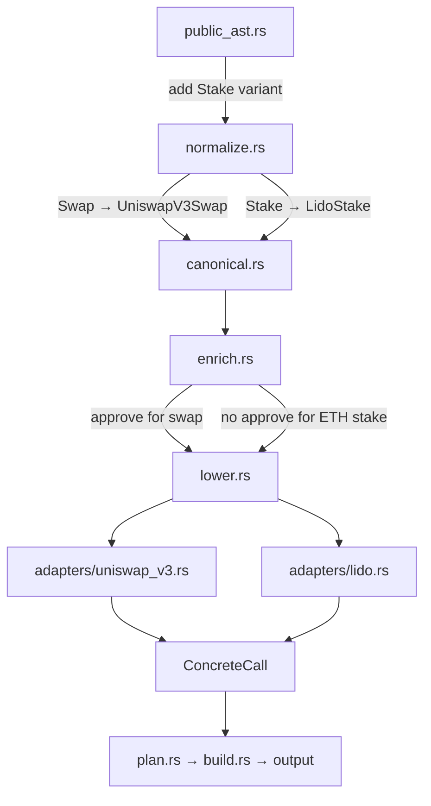

# Implementation Plan: New Primitives (swap, lend, borrow, stake)

## Summary

Add four new DeFi primitives to the intent-script compiler:

| Primitive | Protocol | Status |
|-----------|----------|--------|
| **swap** | Uniswap V3 `exactInputSingle` | New adapter needed |
| **lend** (deposit) | Aave V3 `supply` | Already implemented as `deposit` → `AaveV3Supply` |
| **borrow** | Aave V3 `borrow` | IR + adapter exist; normalizer already wired |
| **stake** | Lido `submit` | New adapter needed |

> **Note:** `lend` is already covered by the existing `deposit` step with `"into": "aave"`. The `borrow` normalizer arm is already connected. The real new work is **swap** (Uniswap V3) and **stake** (Lido).

---

## JSON Schema for New Actions

### Swap (already in AST, needs normalizer + adapter)
```json
{ "swap": { "from": "USDC", "amount": "1000", "to": "WETH" } }
```

### Stake (new AST variant)
```json
{ "stake": { "asset": "ETH", "amount": "10.0", "into": "lido" } }
```

### Borrow (already in AST + normalizer)
```json
{ "borrow": { "asset": "USDC", "amount": "500", "from": "aave" } }
```

### Deposit / Lend (already fully working)
```json
{ "deposit": { "asset": "USDC", "amount": "5000", "into": "aave" } }
```

---

## Architecture: What Changes Where



---

## Detailed File Changes

### 1. `crates/intent-script/src/schema/public_ast.rs`

Add a `Stake` variant to the `Step` enum:

```rust
#[derive(Debug, Deserialize)]
#[serde(rename_all = "snake_case")]
pub enum Step {
    Swap(SwapStep),
    Deposit(DepositStep),
    Borrow(BorrowStep),
    Withdraw(WithdrawStep),
    Wrap(WrapStep),
    Unwrap(UnwrapStep),
    Stake(StakeStep),       // ← NEW
    Custom(serde_json::Value),
}

#[derive(Debug, Deserialize)]
pub struct StakeStep {
    pub asset: String,      // "ETH"
    pub amount: String,     // "10.0"
    pub into: String,       // "lido"
}
```

The existing `SwapStep` already has the right shape: `{ from, amount, to }`.

### 2. `crates/intent-script/src/ir/canonical.rs`

Add two new `ResolvedStep` variants:

```rust
pub enum ResolvedStep {
    // ... existing variants ...

    /// Uniswap V3 exactInputSingle swap
    UniswapV3Swap {
        router: Address,
        token_in: Address,
        token_out: Address,
        amount_in: U256,
        fee: u32,               // 500, 3000, or 10000
        recipient: Address,
        deadline: U256,
        amount_out_minimum: U256,
    },

    /// Lido stETH staking via submit()
    LidoStake {
        lido: Address,          // Lido stETH contract
        amount: U256,           // ETH amount in wei
        referral: Address,      // referral address (Address::ZERO)
    },
}
```

### 3. `crates/intent-script/src/compiler/normalize.rs`

Wire up the `Step::Swap` and `Step::Stake` match arms:

**Swap normalization:**
- Resolve `from` and `to` token addresses and decimals
- Look up Uniswap V3 router from protocol config (`"uniswap"` → `contracts.router`)
- Parse amount with `from` token decimals
- Use default fee tier (3000 = 0.3%) and slippage (0 for now, `amount_out_minimum = 0`)
- Set deadline to `U256::MAX` (no expiry in offline compilation)

**Stake normalization:**
- Resolve asset (must be ETH / native)
- Look up Lido contract from protocol config (`"lido"` → `contracts.steth`)
- Parse amount with 18 decimals
- Set referral to `Address::ZERO`

### 4. `crates/intent-script/src/compiler/enrich.rs`

Add enrichment rules:

**For `UniswapV3Swap`:**
- If `token_in` is not native (not Address::ZERO), insert `Erc20Approve { token: token_in, spender: router, amount: amount_in }` before the swap
- Track `token_out` in `tokens_to_sweep` when router batching is active

**For `LidoStake`:**
- No approval needed (ETH is sent as `msg.value`)
- Track stETH address in `tokens_to_sweep` when router batching is active

**For `AaveV3Borrow`:**
- No approval needed (borrower has already set up collateral)
- No sweep needed (borrowed tokens go to `on_behalf_of`)

### 5. `crates/intent-script/src/adapters/uniswap_v3.rs` (NEW)

```rust
alloy_sol_types::sol! {
    struct ExactInputSingleParams {
        address tokenIn;
        address tokenOut;
        uint24 fee;
        address recipient;
        uint256 deadline;
        uint256 amountIn;
        uint256 amountOutMinimum;
        uint160 sqrtPriceLimitX96;
    }
    function exactInputSingle(ExactInputSingleParams params) external payable returns (uint256);
}

pub fn lower_swap(step: &ResolvedStep) -> Result<Vec<ConcreteCall>> {
    // Destructure UniswapV3Swap, encode exactInputSingle call
    // If token_in is native ETH, set value = amount_in (swap ETH directly)
    // sqrtPriceLimitX96 = 0 (no price limit)
}
```

**Key detail:** When swapping native ETH, the Uniswap V3 router accepts ETH via `msg.value` and the `tokenIn` should be WETH address (the router wraps internally). The `value` field on the `ConcreteCall` should be set to `amount_in`.

### 6. `crates/intent-script/src/adapters/lido.rs` (NEW)

```rust
alloy_sol_types::sol! {
    function submit(address _referral) external payable returns (uint256);
}

pub fn lower_stake(step: &ResolvedStep) -> Result<Vec<ConcreteCall>> {
    // Destructure LidoStake, encode submit() call
    // value = amount (sending ETH)
}
```

Lido's `submit(address _referral)` is called with ETH value. It returns stETH 1:1.

### 7. `crates/intent-script/src/adapters/mod.rs`

Register the new adapters:

```rust
pub mod aave_v3;
pub mod erc20;
pub mod lido;          // ← NEW
pub mod uniswap_v3;    // ← NEW
pub mod wrap;

pub fn lower_step(step: &ResolvedStep, _registry: &RegistryContext) -> Result<Vec<ConcreteCall>> {
    match step {
        // ... existing arms ...
        ResolvedStep::UniswapV3Swap { .. } => uniswap_v3::lower_swap(step),
        ResolvedStep::LidoStake { .. } => lido::lower_stake(step),
    }
}
```

### 8. `config/protocols/ethereum.json`

Add Uniswap V3 and Lido protocol entries:

```json
{
  "aave": {
    "type": "lending",
    "version": "v3",
    "contracts": {
      "pool": "0x87870Bca3F3fD6335C3F4ce8392D69350B4fA4E2"
    }
  },
  "uniswap": {
    "type": "dex",
    "version": "v3",
    "contracts": {
      "router": "0xE592427A0AEce92De3Edee1F18E0157C05861564",
      "quoter": "0xb27308f9F90D607463bb33eA1BeBb41C27CE5AB6"
    }
  },
  "lido": {
    "type": "staking",
    "version": "v1",
    "contracts": {
      "steth": "0xae7ab96520DE3A18E5e111B5EaAb095312D7fE84"
    }
  },
  "intent_router": {
    "type": "router",
    "version": "v1",
    "contracts": {
      "router": "0x1111111254EEB25477B68fb85Ed929f73A960582"
    }
  }
}
```

### 9. `config/assets/ethereum.json`

Add stETH:

```json
{
  "stETH": {
    "address": "0xae7ab96520DE3A18E5e111B5EaAb095312D7fE84",
    "decimals": 18
  }
}
```

---

## Test Scenarios

### Rust Integration Tests (`crates/intent-script/tests/integration.rs`)

#### Test 1: Swap USDC → WETH
```json
{
  "network": "ethereum",
  "from": "0xd8dA6BF26964aF9D7eEd9e03E53415D37aA96045",
  "steps": [
    { "swap": { "from": "USDC", "amount": "1000", "to": "WETH" } }
  ]
}
```
**Expected:** Batched tx via router containing `[approve USDC → router, exactInputSingle]`. Verify calldata starts with `execute()` selector, targets the router.

#### Test 2: Deposit + Borrow in single tx
```json
{
  "network": "ethereum",
  "from": "0xd8dA6BF26964aF9D7eEd9e03E53415D37aA96045",
  "steps": [
    { "deposit": { "asset": "USDC", "amount": "5000", "into": "aave" } },
    { "borrow": { "asset": "DAI", "amount": "2000", "from": "aave" } }
  ]
}
```
**Expected:** Batched tx via router containing `[approve USDC → pool, supply USDC, borrow DAI]`. Three calls in one `execute()`.

#### Test 3: Swap USDC → WETH, deposit WETH in Aave, borrow DAI
```json
{
  "network": "ethereum",
  "from": "0xd8dA6BF26964aF9D7eEd9e03E53415D37aA96045",
  "steps": [
    { "swap": { "from": "USDC", "amount": "5000", "to": "WETH" } },
    { "deposit": { "asset": "WETH", "amount": "2.0", "into": "aave" } },
    { "borrow": { "asset": "DAI", "amount": "1000", "from": "aave" } }
  ]
}
```
**Expected:** Batched tx with `[approve USDC → router, swap, approve WETH → pool, supply WETH, borrow DAI]`.

#### Test 4: Swap USDC → ETH, stake ETH in Lido → stETH
```json
{
  "network": "ethereum",
  "from": "0xd8dA6BF26964aF9D7eEd9e03E53415D37aA96045",
  "steps": [
    { "swap": { "from": "USDC", "amount": "5000", "to": "ETH" } },
    { "stake": { "asset": "ETH", "amount": "2.0", "into": "lido" } }
  ]
}
```
**Expected:** Batched tx with `[approve USDC → router, swap USDC→ETH, lido.submit]`. stETH in sweep list.

### Foundry Fork Tests (`contracts/test/IntentForkTests.t.sol`)

These tests run against mainnet forks using actual deployed contracts. They use foundry submodules for interface definitions.

#### Required Submodules

```bash
# In contracts/ directory:
forge install aave/aave-v3-core --no-commit
forge install Uniswap/v3-periphery --no-commit  
forge install lidofinance/lido-dao --no-commit
```

Alternatively, since we only need interfaces, we can define minimal interfaces inline in the test file to avoid heavy submodule dependencies. **Recommended approach: use inline interfaces** for the fork tests since we only call a few functions.

#### Fork Test 1: Swap USDC → WETH via Uniswap V3

```
1. Fork mainnet at a recent block
2. Impersonate a USDC whale (e.g., Circle's address)
3. Transfer USDC to test user
4. User approves Uniswap V3 router
5. Call exactInputSingle(USDC → WETH, fee=3000)
6. Assert user received WETH > 0
```

#### Fork Test 2: Deposit USDC + Borrow DAI via Aave V3

```
1. Fork mainnet
2. Impersonate USDC whale, fund test user
3. User approves Aave pool
4. Call pool.supply(USDC, amount, user, 0)
5. Call pool.borrow(DAI, amount, 2, 0, user)
6. Assert user has DAI > 0
```

#### Fork Test 3: Swap + Deposit + Borrow (multi-step via router)

```
1. Fork mainnet
2. Deploy IntentRouter
3. Fund user with USDC
4. Build router.execute() calldata with:
   - approve USDC to router
   - swap USDC → WETH via Uniswap
   - approve WETH to Aave pool
   - supply WETH to Aave
   - borrow DAI from Aave
5. Execute through router
6. Assert user has DAI
```

#### Fork Test 4: Swap USDC → ETH, Stake ETH in Lido

```
1. Fork mainnet
2. Fund user with USDC
3. Deploy IntentRouter
4. Build router.execute() calldata with:
   - approve USDC to router
   - swap USDC → ETH via Uniswap (using WETH unwrap)
   - lido.submit{value: ethAmount}(address(0))
5. Execute through router
6. Assert user has stETH > 0
```

**Note on ETH swaps:** Uniswap V3 router returns WETH, not ETH. To get ETH for Lido staking, we need an intermediate WETH.withdraw() step, or use the Uniswap V3 router's `unwrapWETH9` function. The compiler should handle this automatically in the enricher when it detects a swap output of ETH followed by a step that needs native ETH.

---

## Foundry Configuration Updates

### `contracts/foundry.toml`

Add fork URL support and remappings:

```toml
[profile.default]
src = "src"
out = "out"
libs = ["lib"]
solc = "0.8.28"
fs_permissions = [{ access = "read", path = "test/fixtures" }]

[profile.fork]
fork_url = "${ETH_RPC_URL}"
```

### Submodule Strategy

Rather than pulling in full protocol repos as submodules (which are heavy), we will:

1. **Define minimal Solidity interfaces** inline in the test files for Uniswap V3, Aave V3, and Lido
2. **Use `vm.createSelectFork()`** to fork mainnet at a pinned block
3. **Use `deal()` and `vm.prank()`** to set up test state

This keeps the repo lightweight while still testing against real contract implementations.

---

## Implementation Order

1. **Config changes** — add protocols and assets to JSON configs
2. **AST** — add `Stake` variant to `Step` enum
3. **IR** — add `UniswapV3Swap` and `LidoStake` to `ResolvedStep`
4. **Normalizer** — wire `Swap` → `UniswapV3Swap` and `Stake` → `LidoStake`
5. **Enricher** — add approval insertion for swaps, sweep tracking for stake
6. **Adapters** — create `uniswap_v3.rs` and `lido.rs`, register in `mod.rs`
7. **Rust integration tests** — all 4 scenarios
8. **Foundry fork tests** — all 4 scenarios with real contracts

---

## Edge Cases to Handle

1. **Swap from native ETH**: When `token_in` is ETH (native), the swap should send ETH as `msg.value` to the Uniswap router. The router wraps it internally. No ERC-20 approval needed.

2. **Swap to native ETH**: Uniswap V3 returns WETH. If the next step needs native ETH (like Lido stake), the compiler should auto-insert a WETH unwrap step in the enricher.

3. **Fee tier selection**: Default to 3000 (0.3%). The `SwapStep` could optionally accept a `fee` field, but for v1 we use the default.

4. **Slippage**: Set `amountOutMinimum = 0` for offline compilation. A future `CompilerPolicy` will control this.

5. **Deadline**: Set to `U256::MAX` for offline compilation (no expiry). The signer/executor can override.
