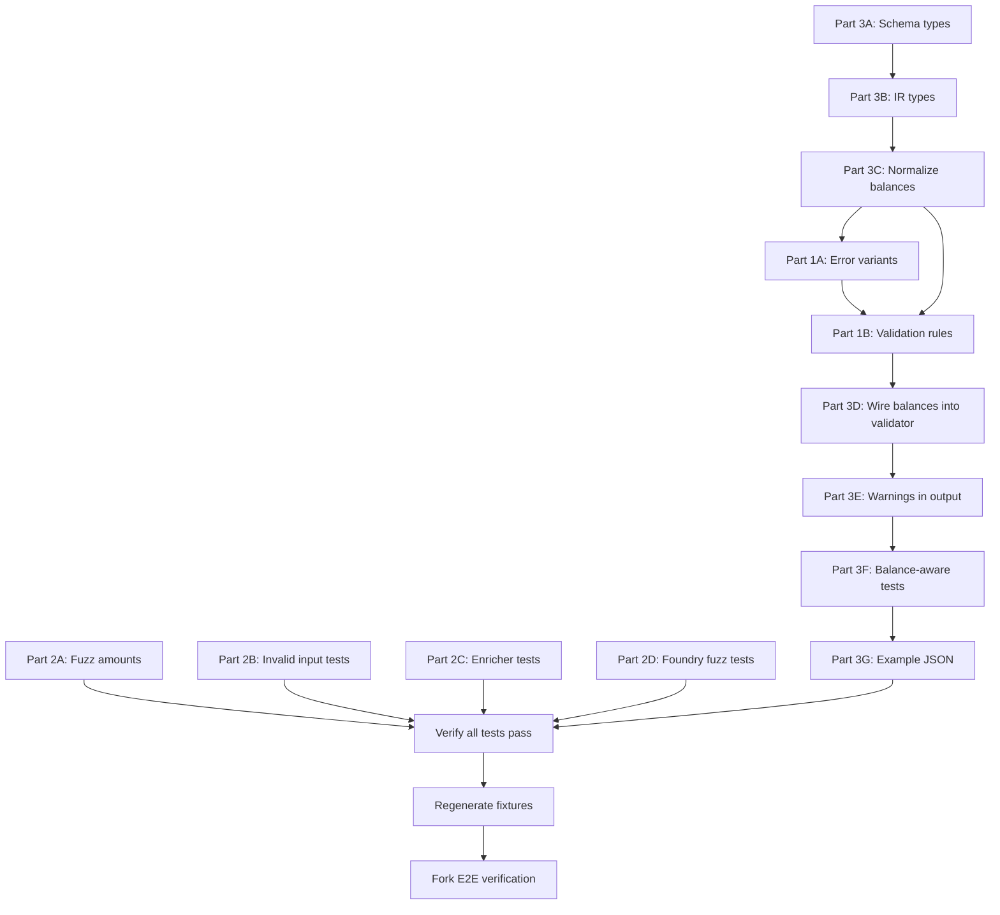

# Implementation Plan: Validation, Testing & Balance-Aware Compilation

## Overview

This plan implements the three categories from [`plans/next-steps-task.md`](next-steps-task.md):
1. Intent chain validation (5 rules in `validate.rs`)
2. Comprehensive testing (fuzz, edge cases, error paths)
3. Balance-aware compilation (optional `balances` input)

**Key design decision**: Parts 1 and 3 are intertwined. Rules 1 & 2 (borrow/withdraw require prior deposit) depend on knowing whether the user has existing positions. The approach:

- **When `balances` is `None`** (no balance info): Rules 1 & 2 produce **warnings**, not errors. The compiler can't know if the user has existing Aave positions, so it compiles optimistically. This preserves all existing tests and the current fork E2E behavior.
- **When `balances` is `Some`**: Rules 1 & 2 become **strict** — borrow without deposit is rejected unless `balances.aave_positions.supplied` shows existing collateral.
- **Rules 3-5** (amount validation, asset compatibility, protocol existence): Always enforced regardless of balance info.

**Constraint**: All 7 fork E2E tests must continue to pass. No existing test behavior changes.

---

## Execution Order

Parts 1 and 3 are implemented together since validation rules depend on balance awareness. Part 2 is independent and can be done in parallel.



---

## Step-by-Step Implementation

### Step 1: Schema types — `UserBalances` and `AavePositions`

**File**: [`crates/intent-script/src/schema/public_ast.rs`](../crates/intent-script/src/schema/public_ast.rs)

Add to `IntentScript`:
```rust
#[serde(default)]
pub balances: Option<UserBalances>,
```

Add new types:
```rust
#[derive(Debug, Deserialize, Default)]
pub struct UserBalances {
    #[serde(default)]
    pub tokens: HashMap<String, String>,
    #[serde(default)]
    pub aave_positions: Option<AavePositions>,
}

#[derive(Debug, Deserialize, Default)]
pub struct AavePositions {
    #[serde(default)]
    pub supplied: HashMap<String, String>,
    #[serde(default)]
    pub borrowed: HashMap<String, String>,
    #[serde(default)]
    pub health_factor: Option<String>,
}
```

**Why**: The `balances` field is `Option` — when absent, the compiler works exactly as today. When present, it enables stricter validation and better warnings.

**Impact on existing tests**: None — `#[serde(default)]` means existing JSON without `balances` deserializes to `None`.

---

### Step 2: IR types — `ResolvedBalances`

**File**: [`crates/intent-script/src/ir/canonical.rs`](../crates/intent-script/src/ir/canonical.rs)

Add to `ResolvedIntent`:
```rust
pub user_balances: Option<ResolvedBalances>,
```

Add new type:
```rust
#[derive(Debug, Clone, Default)]
pub struct ResolvedBalances {
    /// Token address → balance in smallest unit
    pub tokens: HashMap<Address, U256>,
    /// Aave supplied token address → amount
    pub aave_supplied: HashMap<Address, U256>,
    /// Aave borrowed token address → amount
    pub aave_borrowed: HashMap<Address, U256>,
    /// Aave health factor as float
    pub aave_health_factor: Option<f64>,
}
```

**Impact on existing code**: `normalize()` currently constructs `ResolvedIntent` — needs to set `user_balances: None` for backward compat, then parse when present.

---

### Step 3: Normalize balances

**File**: [`crates/intent-script/src/compiler/normalize.rs`](../crates/intent-script/src/compiler/normalize.rs)

In `normalize()`, after constructing the `ResolvedIntent`, parse `script.balances` if present:
- Resolve token aliases to addresses using the registry
- Parse amount strings to `U256` using `parse_amount()` with the token's decimals
- Parse health factor string to `f64`

Set `intent.user_balances = parsed_balances`.

**Impact on existing tests**: None — existing JSON has no `balances` field, so `script.balances` is `None`.

---

### Step 4: Error variants

**File**: [`crates/intent-script/src/error.rs`](../crates/intent-script/src/error.rs)

Add:
```rust
#[error("Invalid intent chain: {0}")]
InvalidChain(String),
```

This is used by validation Rules 1-4 for structural chain errors.

---

### Step 5: Validation rules in `validate.rs`

**File**: [`crates/intent-script/src/compiler/validate.rs`](../crates/intent-script/src/compiler/validate.rs)

Add a `ValidationContext` that walks through steps and tracks state:

```rust
struct ValidationContext {
    deposited_protocols: HashSet<String>,
    user_balances: Option<ResolvedBalances>,
    warnings: Vec<String>,
}
```

#### Rule 1: Borrow requires prior deposit or existing collateral
- Walk steps in order. When encountering `AaveV3Supply`, add protocol to `deposited_protocols`.
- When encountering `AaveV3Borrow`:
  - If protocol is in `deposited_protocols` → OK
  - Else if `user_balances.aave_supplied` has any non-zero value → OK (existing collateral)
  - Else if `user_balances` is `Some` but no collateral → **Error**: `InvalidChain("Borrow from aave requires collateral...")`
  - Else if `user_balances` is `None` → **Warning**: "Borrow without prior deposit — ensure user has existing Aave collateral"

#### Rule 2: Withdraw requires prior deposit or existing position
- Same logic as Rule 1 but for `AaveV3Withdraw`.
- Check `user_balances.aave_supplied` for the specific asset being withdrawn.

#### Rule 3: Amount validation
- Check all amounts are positive (> 0). This is checked during normalization already for parse errors, but add explicit `U256::ZERO` check in validate.
- Reject `"0"` amounts.

#### Rule 4: Asset compatibility
- Can't deposit native ETH directly into Aave — asset address would be `Address::ZERO` in `AaveV3Supply`. Reject with "Wrap ETH to WETH before depositing into Aave".
- Can't swap from an asset to the same asset — `token_in == token_out` in `UniswapV3Swap`. Reject with "Cannot swap asset to itself".
- Wrap step: already handled by normalization (only ETH and stETH are valid wrap assets).

#### Rule 5: Protocol existence
- Already handled by normalization (`UnknownProtocol` error). Add test coverage to confirm.

**Return type change**: `validate()` returns `Result<Vec<String>>` where `Vec<String>` is warnings. The caller stores warnings for output.

**Impact on existing tests**: None — all existing intents are valid chains. The only new errors are for genuinely invalid inputs. Warnings are informational.

---

### Step 6: Wire balances through the pipeline

**File**: [`crates/intent-script/src/compiler/mod.rs`](../crates/intent-script/src/compiler/mod.rs)

Update `compile()` to:
1. Pass `user_balances` from `ResolvedIntent` to `validate()`
2. Collect warnings from `validate()`
3. Pass warnings through to the output

---

### Step 7: Warnings in output

**File**: [`crates/intent-script/src/output.rs`](../crates/intent-script/src/output.rs)

Add `warnings: Vec<String>` to `CompileOutput` variants (or as a wrapper):

```rust
pub struct CompileResult {
    pub output: CompileOutput,
    pub warnings: Vec<String>,
}
```

Or simpler: add `warnings` to `Eip712IntentOutput` and `UnsignedTx` since those are the output types. The JSON serialization includes warnings when non-empty.

**Preferred approach**: Wrap `CompileOutput` in a `CompileResult` struct. Update `compile()` return type to `Result<CompileResult>`. This is a breaking API change but minimal — callers just access `.output` for the existing behavior.

**Alternative** (less invasive): Add warnings to `CompileOutputJson` only, keeping the Rust API unchanged. The warnings are only visible in JSON output.

**Decision**: Use the wrapper approach. It's cleaner and the API surface is small (only `compile()` and tests use it). Update all callers.

---

### Step 8: Balance-aware integration tests

**File**: [`crates/intent-script/tests/integration.rs`](../crates/intent-script/tests/integration.rs)

Add tests:
```rust
// Borrow with existing collateral (balance-aware) — should compile
test_borrow_with_existing_collateral()

// Borrow without deposit and no balance info — should compile with warning
test_borrow_without_deposit_warns()

// Borrow without deposit and balance shows no collateral — should fail
test_borrow_without_collateral_fails()

// Withdraw with existing position — should compile
test_withdraw_with_existing_position()

// Withdraw without deposit and balance shows no position — should fail
test_withdraw_without_position_fails()
```

---

### Step 9: Example JSON

**File**: `crates/intent-script/examples/borrow_existing_collateral.json`

```json
{
  "network": "ethereum",
  "from": "0xd8dA6BF26964aF9D7eEd9e03E53415D37aA96045",
  "balances": {
    "tokens": { "USDC": "50000.0" },
    "aave_positions": {
      "supplied": { "USDC": "50000.0" },
      "borrowed": { "DAI": "5000.0" },
      "health_factor": "1.85"
    }
  },
  "steps": [
    { "borrow": { "asset": "DAI", "amount": "1000", "from": "aave" } }
  ]
}
```

---

### Step 10: Fuzz tests for amount parsing

**File**: `crates/intent-script/tests/fuzz_amounts.rs` (new)

Test the `parse_amount` function with edge cases:
- Very large amounts: `"999999999999999999999"`
- Very small amounts: `"0.000001"` (6 decimals for USDC)
- Trailing zeros: `"1.50000"`
- Leading zeros: `"001.5"`
- Empty string, just a dot `"."`, multiple dots `"1.2.3"`
- Negative amounts: `"-1.5"`
- Scientific notation: `"1e18"`
- Whitespace: `" 1.5 "`
- Comma separators: `"1,000.50"`
- Zero amount: `"0"`, `"0.0"`, `"0.000000"`
- Maximum precision per token decimals

Note: `parse_amount` is currently private. Either make it `pub(crate)` or test through the public `compile()` API. Preferred: make it `pub(crate)` for direct testing.

---

### Step 11: Invalid input tests

**File**: [`crates/intent-script/tests/integration.rs`](../crates/intent-script/tests/integration.rs)

Add tests for every error path:

**JSON structure errors:**
- Missing `network` field
- Missing `from` field  
- Missing `steps` field
- Empty `from` string
- Invalid `from` (not a hex address)
- Unknown step type: `{ "fly": { ... } }`
- Step with missing required fields: `{ "deposit": { "asset": "USDC" } }` (no amount, no into)

**Amount errors:**
- Zero amount: `"0"`
- Negative amount: `"-100"`
- Non-numeric: `"abc"`

**Chain validation errors (from Part 1):**
- Swap same asset to itself
- Deposit native ETH into Aave (should fail with helpful message)

---

### Step 12: Enricher edge case tests

**File**: `crates/intent-script/tests/enricher_tests.rs` (new)

Test the enricher's token routing logic by compiling intents and inspecting the output:
- Swap USDC→WETH then deposit WETH into Aave — WETH should NOT have a transferFrom (it's already in the router from the swap)
- Multiple borrows — each borrowed asset should be in sweep tokens
- Single-step intents produce `SingleTx`, not batched

---

### Step 13: Foundry fuzz tests

**File**: [`contracts/test/IntentRouter.t.sol`](../contracts/test/IntentRouter.t.sol)

Add fuzz tests:
- `testFuzz_executeDirect_emptyCallsReverts` — empty calls array should revert
- `testFuzz_sweep_unknownToken` — sweep with random token addresses
- `testFuzz_executeSigned_invalidSignature` — invalid signatures should revert

---

### Step 14: Regenerate fixtures and verify

```bash
make generate-fixtures
cargo test --workspace
cd contracts && forge test --mc IntentForkE2E --fork-url $ETH_RPC_URL -vvv
```

All 7 fork E2E tests must pass. All Rust tests must pass.

---

## Files Changed Summary

| File | Type | Change |
|------|------|--------|
| `crates/intent-script/src/schema/public_ast.rs` | Modify | Add `UserBalances`, `AavePositions`, `balances` field |
| `crates/intent-script/src/ir/canonical.rs` | Modify | Add `ResolvedBalances`, `user_balances` field |
| `crates/intent-script/src/compiler/normalize.rs` | Modify | Parse balances, make `parse_amount` pub(crate) |
| `crates/intent-script/src/error.rs` | Modify | Add `InvalidChain` variant |
| `crates/intent-script/src/compiler/validate.rs` | Modify | Add `ValidationContext`, 5 validation rules |
| `crates/intent-script/src/compiler/mod.rs` | Modify | Wire warnings through pipeline |
| `crates/intent-script/src/output.rs` | Modify | Add `CompileResult` wrapper with warnings |
| `crates/intent-script/src/lib.rs` | Modify | Export `CompileResult` |
| `crates/intent-script/tests/integration.rs` | Modify | Add invalid input + balance-aware tests |
| `crates/intent-script/tests/fuzz_amounts.rs` | Create | Amount parsing fuzz tests |
| `crates/intent-script/tests/enricher_tests.rs` | Create | Enricher edge case tests |
| `crates/intent-script/tests/generate_calldata.rs` | Modify | Update for `CompileResult` API |
| `crates/intent-script/tests/generate_eip712_fixtures.rs` | Modify | Update for `CompileResult` API |
| `contracts/test/IntentRouter.t.sol` | Modify | Add fuzz tests |
| `crates/intent-script/examples/borrow_existing_collateral.json` | Create | Balance-aware example |

## Risk Assessment

- **Low risk**: Parts 2A-2D (testing) — purely additive, no production code changes
- **Medium risk**: Part 1 (validation) — new validation could reject previously-valid inputs. Mitigated by making Rules 1&2 warnings when no balance info.
- **Medium risk**: Part 3 (balance-aware) — schema change + API change. Mitigated by `Option` types and `#[serde(default)]`.
- **Key invariant**: `compile()` with existing JSON (no `balances` field) must produce identical output. The only difference is the return type wrapper.
