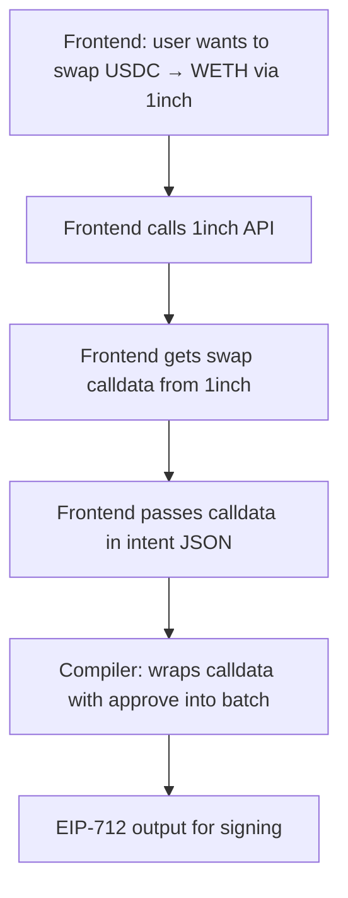

# Plan: Protocol Adapters — Complete DeFi Coverage

## Current State

The compiler already supports these protocols via adapters:

| Protocol | Action | Adapter File | Status |
|----------|--------|-------------|--------|
| WETH | wrap / unwrap | [`adapters/wrap.rs`](../crates/intent-script/src/adapters/wrap.rs) | ✅ Working |
| ERC-20 | approve | [`adapters/erc20.rs`](../crates/intent-script/src/adapters/erc20.rs) | ✅ Working |
| Aave V3 | supply / borrow / withdraw | [`adapters/aave_v3.rs`](../crates/intent-script/src/adapters/aave_v3.rs) | ✅ Working |
| Uniswap V3 | swap (exactInputSingle) | [`adapters/uniswap_v3.rs`](../crates/intent-script/src/adapters/uniswap_v3.rs) | ✅ Working |
| Lido | stake ETH → stETH | [`adapters/lido.rs`](../crates/intent-script/src/adapters/lido.rs) | ✅ Working |

## What Needs to Be Added

| Protocol | Action | Priority | New Work |
|----------|--------|----------|----------|
| Lido wstETH | wrap stETH → wstETH | High | New adapter + IR variant |
| ERC-20 permit | gasless approve via signature | High | New adapter + IR variant |
| 1inch | single swap (pure calldata) | Medium | New adapter + IR variant |
| CoW Swap | single swap (order struct) | Low | New adapter + IR variant (post-MVP) |

---

## 1. Lido wstETH Wrapping

### Problem

The current Lido adapter only supports `ETH → stETH` via [`submit()`](../crates/intent-script/src/adapters/lido.rs:17). The user requested the full flow: `ETH → stETH → wstETH`. The wstETH contract has a `wrap(uint256)` function that converts stETH to wstETH.

### JSON Schema

```json
{ "stake": { "asset": "ETH", "amount": "10.0", "into": "lido" } }
```

This already works for `ETH → stETH`. To support the full chain to wstETH, we add a new step type:

```json
{ "wrap_steth": { "amount": "10.0" } }
```

Or better — extend the existing `wrap` step to handle stETH → wstETH:

```json
{ "wrap": { "asset": "stETH", "amount": "10.0" } }
```

The normalizer detects that wrapping stETH means calling `wstETH.wrap()` instead of `WETH.deposit()`.

### IR Changes

Add a new variant to [`ResolvedStep`](../crates/intent-script/src/ir/canonical.rs:21):

```rust
/// Wrap stETH → wstETH via wstETH.wrap(uint256)
WstETHWrap {
    wsteth: Address,
    steth: Address,
    amount: U256,
},
```

### Adapter: `adapters/lido.rs` (extend existing)

```rust
alloy_sol_types::sol! {
    // Existing
    function submit(address _referral) external payable returns (uint256);
    // New — wstETH
    function wrap(uint256 _stETHAmount) external returns (uint256);
}

pub fn lower_wsteth_wrap(step: &ResolvedStep) -> Result<Vec<ConcreteCall>> {
    let ResolvedStep::WstETHWrap { wsteth, amount, .. } = step else {
        return Err(CompileError::Adapter("Expected WstETHWrap step".into()));
    };
    let calldata = wrapCall { _stETHAmount: *amount }.abi_encode();
    Ok(vec![ConcreteCall {
        to: *wsteth,
        calldata: Bytes::from(calldata),
        value: U256::ZERO,
        description: format!("Wrap {} wei stETH to wstETH", amount),
    }])
}
```

### Enrichment Changes

In [`enrich.rs`](../crates/intent-script/src/compiler/enrich.rs), add a case for `WstETHWrap`:

- Insert `Erc20Approve { token: stETH, spender: wstETH, amount }` before the wrap
- Track wstETH in `tokens_to_sweep` when batching

### Normalization Changes

In [`normalize.rs`](../crates/intent-script/src/compiler/normalize.rs:37), update the `Step::Wrap` handler:

```rust
Step::Wrap(w) => {
    if w.asset == "stETH" || registry.is_steth(&w.asset) {
        // Wrap stETH → wstETH
        let wsteth = resolve_protocol_contract("lido", "wsteth", registry)?;
        let steth = resolve_asset_address("stETH", registry)?;
        let decimals = resolve_asset_decimals("stETH", registry)?;
        let amount = parse_amount(&w.amount, decimals)?;
        Ok(ResolvedStep::WstETHWrap { wsteth, steth, amount })
    } else {
        // Existing: wrap native → WETH
        // ...
    }
}
```

### Config Changes

Add wstETH to [`config/assets/ethereum.json`](../config/assets/ethereum.json):

```json
{
  "wstETH": {
    "address": "0x7f39C581F595B53c5cb19bD0b3f8dA6c935E2Ca0",
    "decimals": 18
  }
}
```

Add wstETH contract to [`config/protocols/ethereum.json`](../config/protocols/ethereum.json):

```json
{
  "lido": {
    "type": "staking",
    "version": "v1",
    "contracts": {
      "steth": "0xae7ab96520DE3A18E5e111B5EaAb095312D7fE84",
      "wsteth": "0x7f39C581F595B53c5cb19bD0b3f8dA6c935E2Ca0"
    }
  }
}
```

### Composite Flow: ETH → stETH → wstETH

The user can express this as two steps:

```json
{
  "steps": [
    { "stake": { "asset": "ETH", "amount": "10.0", "into": "lido" } },
    { "wrap": { "asset": "stETH", "amount": "10.0" } }
  ]
}
```

The compiler batches these into a single router tx:
1. `lido.submit{value: 10 ETH}(address(0))` → stETH minted to router
2. `stETH.approve(wstETH, 10e18)`
3. `wstETH.wrap(10e18)` → wstETH minted to router
4. Sweep wstETH back to user

---

## 2. ERC-20 Permit (EIP-2612)

### Problem

Currently, the compiler inserts `ERC20.approve()` calls before protocol interactions. This requires an on-chain transaction. EIP-2612 `permit()` allows gasless approvals via an off-chain signature.

### When to Use Permit

Permit is useful when:
- The token supports EIP-2612 (USDC, DAI, most modern tokens)
- The user wants to avoid a separate approve tx
- The approval is part of a batched flow through the router

### JSON Schema

No change to the user-facing JSON. The compiler automatically uses `permit` instead of `approve` when the token supports it. This is an optimization in the enrichment stage.

However, for the MVP, we add an explicit `permit` step type for testing:

```json
{ "permit": { "asset": "USDC", "amount": "5000", "spender": "aave" } }
```

### IR Changes

Add to [`ResolvedStep`](../crates/intent-script/src/ir/canonical.rs:21):

```rust
/// ERC-20 permit (EIP-2612) — gasless approval via signature
Erc20Permit {
    token: Address,
    owner: Address,
    spender: Address,
    value: U256,
    deadline: U256,
    // v, r, s are populated at signing time, not compile time
},
```

### Design Decision: Compile-Time vs Sign-Time

ERC-20 permit requires a signature from the token owner. This creates a chicken-and-egg problem:

1. The compiler needs to produce the permit parameters
2. The user needs to sign the permit
3. The permit signature needs to be included in the calldata

**MVP approach**: The compiler outputs the permit parameters as part of the EIP-712 output. The frontend/SDK is responsible for:
1. Having the user sign the permit (separate EIP-712 signature)
2. Inserting the `v, r, s` values into the calldata
3. Submitting the final transaction

The compiler produces a `PermitData` struct in the output that the frontend uses to construct the `eth_signTypedData_v4` call for the permit.

### Adapter: `adapters/erc20.rs` (extend existing)

```rust
alloy_sol_types::sol! {
    // Existing
    function approve(address spender, uint256 amount) external returns (bool);
    // New — EIP-2612 permit
    function permit(
        address owner,
        address spender,
        uint256 value,
        uint256 deadline,
        uint8 v,
        bytes32 r,
        bytes32 s
    ) external;
}
```

### Output Changes

Add a `permits` array to the compiler output:

```json
{
  "type": "eip712_intent",
  "permits": [
    {
      "token": "0xA0b86991c6218b36c1d19D4a2e9Eb0cE3606eB48",
      "tokenName": "USDC",
      "owner": "0xd8dA...",
      "spender": "0x...",
      "value": "5000000000",
      "nonce": 0,
      "deadline": 1712345678
    }
  ],
  "eip712": { "..." : "..." },
  "directTx": { "..." : "..." }
}
```

The frontend uses each permit entry to request a separate `eth_signTypedData_v4` from the user, then assembles the final calldata with the permit signatures included.

### MVP Simplification

For the MVP, **keep using `approve()` as the default**. Add permit as an opt-in feature that can be enabled later. The infrastructure (IR variant, adapter) should be in place but not wired into the automatic enrichment yet.

---

## 3. 1inch / CoW Swap Integration

### Problem

The current swap adapter only supports Uniswap V3 `exactInputSingle`. For better pricing, the user should be able to use 1inch or CoW Swap for single swaps.

### Design: Pure Calldata Encoding (No HTTP)

**Key design principle**: The compiler is a pure, deterministic program. It does NOT make HTTP calls. The **frontend** is responsible for calling external APIs (1inch, CoW). The compiler either:
- Encodes the function signature the protocol expects (for known ABIs)
- Accepts pre-fetched calldata from the frontend (for dynamic routes)

### Architecture



### JSON Schema

Extend the swap step with an optional `via` field and optional pre-fetched `calldata`:

```json
{ "swap": { "from": "USDC", "amount": "1000", "to": "WETH", "via": "1inch", "calldata": "0x12aa3caf..." } }
{ "swap": { "from": "USDC", "amount": "1000", "to": "WETH", "via": "cow" } }
{ "swap": { "from": "USDC", "amount": "1000", "to": "WETH" } }
```

When `via` is omitted, default to `"uniswap"` (current behavior).

### AST Changes

Update [`SwapStep`](../crates/intent-script/src/schema/public_ast.rs:39):

```rust
#[derive(Debug, Deserialize)]
pub struct SwapStep {
    pub from: String,
    pub amount: String,
    pub to: String,
    #[serde(default)]
    pub via: Option<String>,      // "uniswap", "1inch", "cow"
    #[serde(default)]
    pub fee: Option<String>,      // Uniswap fee tier: "500", "3000", "10000"
    #[serde(default)]
    pub calldata: Option<String>, // Pre-fetched calldata from external API
}
```

### IR Changes

Add new variants to [`ResolvedStep`](../crates/intent-script/src/ir/canonical.rs:21):

```rust
/// 1inch swap — pre-fetched calldata from the 1inch API (provided by frontend)
OneInchSwap {
    router: Address,        // 1inch AggregationRouterV6
    token_in: Address,
    token_out: Address,
    amount_in: U256,
    calldata: Bytes,        // Pre-fetched from 1inch API by the frontend
},

/// CoW Swap order — compiler produces the order struct, frontend submits to CoW API
CowSwapOrder {
    sell_token: Address,
    buy_token: Address,
    sell_amount: U256,
    buy_amount: U256,       // Minimum (from frontend quote)
    receiver: Address,
    valid_to: u32,
    kind: String,           // "sell" or "buy"
},
```

### Adapter: `adapters/oneinch.rs` (NEW) — Pure Calldata Passthrough

The 1inch adapter accepts pre-fetched calldata from the frontend and wraps it into a `ConcreteCall`. The compiler validates the target is the 1inch router and inserts the appropriate ERC-20 approve.

```rust
pub fn lower_oneinch_swap(step: &ResolvedStep) -> Result<Vec<ConcreteCall>> {
    let ResolvedStep::OneInchSwap {
        router, token_in, token_out, amount_in, calldata
    } = step else {
        return Err(CompileError::Adapter("Expected OneInchSwap step".into()));
    };

    Ok(vec![ConcreteCall {
        to: *router,
        calldata: calldata.clone(),
        value: U256::ZERO, // ERC-20 swap, no ETH value
        description: format!(
            "Swap {} wei of {} → {} via 1inch",
            amount_in, token_in, token_out
        ),
    }])
}
```

### Adapter: `adapters/cow_swap.rs` (NEW) — Order Struct Encoder

CoW Swap is an intent-based protocol. The compiler produces the CoW `GPv2Order` struct; the frontend submits it to the CoW API and handles the order lifecycle.

For the MVP, CoW Swap is lower priority. Implement the IR variant and a stub adapter that outputs the order parameters.

### Config Changes

Add 1inch and CoW to [`config/protocols/ethereum.json`](../config/protocols/ethereum.json):

```json
{
  "1inch": {
    "type": "dex_aggregator",
    "version": "v6",
    "contracts": {
      "router": "0x111111125421cA6dc452d289314280a0f8842A65"
    }
  },
  "cow": {
    "type": "dex_aggregator",
    "version": "v2",
    "contracts": {
      "settlement": "0x9008D19f58AAbD9eD0D60971565AA8510560ab41",
      "vault_relayer": "0xC92E8bdf79f0507f65a392b0ab4667716BFE0110"
    }
  }
}
```

### No New Dependencies

Since the compiler is pure (no HTTP calls), no new dependencies are needed for 1inch or CoW Swap. The existing `alloy-primitives` and `alloy-sol-types` are sufficient for ABI encoding.

### MVP Scope

For the MVP:
- **1inch**: Accept pre-fetched calldata from the frontend, wrap it with approve into a batched call. No HTTP client needed. The compiler stays pure and deterministic.
- **CoW Swap**: Implement the IR variant and output the order struct. The frontend handles API submission. Lower priority than 1inch.

---

## 4. Existing Adapter Improvements

### Aave V3 — Already Complete

The current Aave V3 adapter in [`adapters/aave_v3.rs`](../crates/intent-script/src/adapters/aave_v3.rs) already supports:
- `supply()` — deposit collateral
- `borrow()` — borrow against collateral
- `withdraw()` — withdraw collateral

No changes needed.

### Uniswap V3 — Already Complete for Single Swap

The current adapter in [`adapters/uniswap_v3.rs`](../crates/intent-script/src/adapters/uniswap_v3.rs) supports `exactInputSingle`. This covers the "single swap" requirement.

**Improvement needed**: The current adapter hardcodes `fee: 3000` in the normalizer. We should allow the user to specify a fee tier:

```json
{ "swap": { "from": "USDC", "amount": "1000", "to": "WETH", "fee": "500" } }
```

Update [`SwapStep`](../crates/intent-script/src/schema/public_ast.rs:39):

```rust
pub struct SwapStep {
    pub from: String,
    pub amount: String,
    pub to: String,
    #[serde(default)]
    pub via: Option<String>,
    #[serde(default)]
    pub fee: Option<String>,  // "500", "3000", "10000"
}
```

### WETH — Already Complete

The wrap/unwrap adapter in [`adapters/wrap.rs`](../crates/intent-script/src/adapters/wrap.rs) is complete.

---

## Summary of New Files

| File | Purpose |
|------|---------|
| `crates/intent-script/src/adapters/oneinch.rs` | 1inch aggregator swap adapter (pure calldata passthrough) |
| `crates/intent-script/src/adapters/cow_swap.rs` | CoW Swap adapter (order struct encoder, post-MVP) |

## Summary of Modified Files

| File | Change |
|------|--------|
| [`ir/canonical.rs`](../crates/intent-script/src/ir/canonical.rs) | Add `WstETHWrap`, `Erc20Permit`, `OneInchSwap`, `CowSwapOrder` variants |
| [`schema/public_ast.rs`](../crates/intent-script/src/schema/public_ast.rs) | Add `via`, `fee`, `calldata` to `SwapStep`; add `Permit` step |
| [`compiler/normalize.rs`](../crates/intent-script/src/compiler/normalize.rs) | Handle stETH wrapping, 1inch swap routing, permit |
| [`compiler/enrich.rs`](../crates/intent-script/src/compiler/enrich.rs) | Add enrichment for `WstETHWrap` (approve stETH), `OneInchSwap` (approve token_in) |
| [`adapters/mod.rs`](../crates/intent-script/src/adapters/mod.rs) | Register new adapters |
| [`adapters/lido.rs`](../crates/intent-script/src/adapters/lido.rs) | Add `lower_wsteth_wrap()` |
| [`adapters/erc20.rs`](../crates/intent-script/src/adapters/erc20.rs) | Add `lower_permit()` |
| [`config/assets/ethereum.json`](../config/assets/ethereum.json) | Add wstETH |
| [`config/protocols/ethereum.json`](../config/protocols/ethereum.json) | Add wstETH contract, 1inch config, CoW config |

## Test Plan

### Unit Tests (per adapter)

1. **wstETH wrap**: Verify `wrapCall` ABI encoding matches expected calldata
2. **ERC-20 permit**: Verify `permitCall` ABI encoding
3. **1inch swap**: Verify pre-fetched calldata passthrough produces correct `ConcreteCall`

### Integration Tests

1. **ETH → stETH → wstETH chain**: Two-step intent produces correct batched calldata
2. **Swap via 1inch**: Intent with `"via": "1inch"` and pre-fetched calldata produces correct output
3. **Swap with custom fee tier**: `"fee": "500"` produces correct Uniswap V3 calldata
4. **Permit + supply**: Permit replaces approve in Aave deposit flow

### Foundry Tests

1. **wstETH wrap through router**: Deploy mock wstETH, verify wrap + sweep
2. **Full Lido flow**: ETH → stETH → wstETH through router
3. **Permit-based approval**: Use permit instead of approve in batched flow
