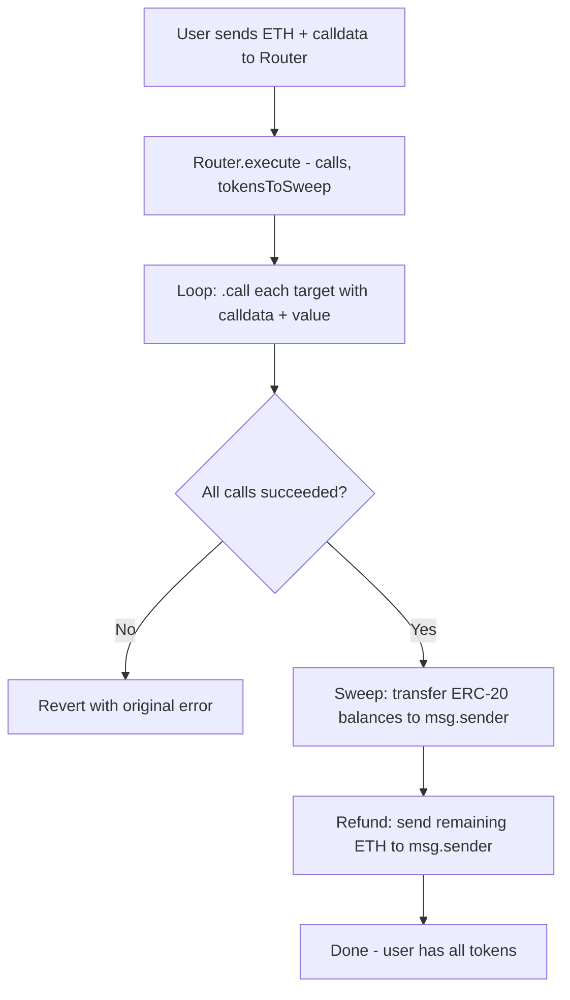

# Router Contract & Batched Execution Design

## Problem

The current compiler outputs individual unsigned transactions. When an intent produces multiple calls (e.g., `approve` + `supply` for Aave), the user must sign and submit each tx separately. This is:

1. **Slow** — multiple round-trips to the chain
2. **Fragile** — if tx 2 fails, tx 1 (the approval) has already been submitted
3. **Not composable** — can't atomically chain operations

## Solution: IntentRouter Contract

A minimal router contract that:
1. Accepts an array of `Call` structs (target, calldata, value)
2. Executes each via low-level `.call()` in sequence
3. Sweeps specified ERC-20 tokens back to `msg.sender` after all calls complete
4. Refunds any remaining ETH to `msg.sender`

This is similar to 1inch's AggregationRouter or Uniswap's Universal Router pattern.

## Router Contract Design

```solidity
// SPDX-License-Identifier: MIT
pragma solidity ^0.8.20;

contract IntentRouter {
    struct Call {
        address target;
        bytes callData;
        uint256 value;
    }

    function execute(
        Call[] calldata calls,
        address[] calldata tokensToSweep
    ) external payable {
        // Execute each call
        for (uint256 i = 0; i < calls.length; i++) {
            (bool success, bytes memory result) = calls[i].target.call{value: calls[i].value}(
                calls[i].callData
            );
            if (!success) {
                // Bubble up revert reason
                assembly { revert(add(result, 32), mload(result)) }
            }
        }

        // Sweep ERC-20 tokens back to caller
        for (uint256 i = 0; i < tokensToSweep.length; i++) {
            uint256 balance = IERC20(tokensToSweep[i]).balanceOf(address(this));
            if (balance > 0) {
                IERC20(tokensToSweep[i]).transfer(msg.sender, balance);
            }
        }

        // Refund remaining ETH
        uint256 ethBalance = address(this).balance;
        if (ethBalance > 0) {
            (bool sent, ) = msg.sender.call{value: ethBalance}("");
            require(sent, "ETH refund failed");
        }
    }

    receive() external payable {}
}
```

## Execution Flow



## Compiler Changes

### Current Pipeline

```
Lower → Plan → Build
         ↓
    Single(call) → SingleTx
    Sequence(calls) → TxSequence (N separate txs)
```

### New Pipeline

```
Lower → Plan → Build
         ↓
    Single(call) → SingleTx (unchanged)
    Sequence(calls) → RouterBatch (1 tx calling router.execute)
```

### Changes to `plan.rs`

The [`ExecutionPlan`](crates/intent-script/src/compiler/plan.rs:10) enum gets a new variant:

```rust
pub enum ExecutionPlan {
    Single(ConcreteCall),
    Sequence(Vec<ConcreteCall>),       // kept for non-EVM or no-router cases
    Batched {                           // NEW: routed through IntentRouter
        calls: Vec<ConcreteCall>,
        router: Address,
        tokens_to_sweep: Vec<Address>,
    },
}
```

The [`plan()`](crates/intent-script/src/compiler/plan.rs:18) function changes: when there are multiple calls AND a router address is available, it produces `Batched` instead of `Sequence`.

### Changes to `build.rs`

The [`build()`](crates/intent-script/src/compiler/build.rs:10) function handles the new `Batched` variant by:
1. ABI-encoding the calls array into `router.execute(calls, tokensToSweep)` calldata
2. Summing all `value` fields to determine total ETH to send
3. Producing a single `UnsignedTx` targeting the router address

### Changes to `enrich.rs`

The enricher needs to know which tokens will end up in the router so it can populate `tokens_to_sweep`. For the wrap case: the output token is WETH, so WETH goes into the sweep list.

### Router Address Source

The router address comes from the registry config. In [`config/protocols/ethereum.json`](config/protocols/ethereum.json), add:

```json
{
  "intent_router": {
    "address": "0x..."
  }
}
```

For Foundry tests, the router is deployed in the test setup and the address is known at test time. The Foundry test is self-contained and doesn't use the Rust compiler — it directly tests the Solidity contract.

For Anvil/Rust tests, the router can be deployed via Alloy and its address passed to the compiler (or set in a test-specific config).

## Foundry Test Design

### Project Structure

```
contracts/
├── foundry.toml
├── src/
│   └── IntentRouter.sol
├── test/
│   └── IntentRouter.t.sol
└── lib/
    └── forge-std/          (installed via forge install)
```

### Test: Wrap ETH Through Router

```
1. Deploy a mock WETH contract (or use forge-std WETH)
2. Deploy IntentRouter
3. User calls router.execute() with:
   - calls: [{ target: WETH, callData: deposit(), value: 1 ether }]
   - tokensToSweep: [WETH]
4. Assert: user WETH balance == 1 ether
5. Assert: router WETH balance == 0
6. Assert: router ETH balance == 0
```

### Test: Wrap + Unwrap Through Router

```
1. Deploy WETH + Router
2. User calls router.execute() with:
   - calls: [
       { target: WETH, callData: deposit(), value: 1 ether },
       { target: WETH, callData: withdraw(1 ether), value: 0 }
     ]
   - tokensToSweep: [WETH]
3. Assert: user ETH balance restored (minus gas)
4. Assert: router balances == 0
```

## Impact on Existing Code

| File | Change |
|------|--------|
| [`plan.rs`](crates/intent-script/src/compiler/plan.rs) | Add `Batched` variant, update `plan()` logic |
| [`build.rs`](crates/intent-script/src/compiler/build.rs) | Handle `Batched` → encode router calldata |
| [`output.rs`](crates/intent-script/src/output.rs) | No change — still produces `SingleTx` for batched |
| [`canonical.rs`](crates/intent-script/src/ir/canonical.rs) | May add sweep token tracking to `ResolvedIntent` |
| [`enrich.rs`](crates/intent-script/src/compiler/enrich.rs) | Track output tokens for sweep list |
| [`mod.rs`](crates/intent-script/src/compiler/mod.rs) | Pass router address from registry to plan/build |
| [`config/protocols/ethereum.json`](config/protocols/ethereum.json) | Add `intent_router` entry |
| [`registry/`](crates/intent-script/src/registry/) | Expose router address lookup |

## Key Design Decisions

1. **Compiler stays generic**: The compiler doesn't know about Solidity or Foundry. It just knows "if multiple calls + router address available → batch into one tx".

2. **Router is EVM-specific**: The router contract and its ABI encoding live in the build stage, which is already EVM-specific (uses `alloy_primitives`).

3. **Foundry tests are separate**: The Foundry test project lives in `contracts/` and tests the Solidity contract directly. It doesn't depend on the Rust compiler.

4. **Anvil tests updated**: The existing Rust/Anvil tests in `crates/evm-testing/` will be updated to deploy the router and test the full flow: compile intent → get batched tx → submit to Anvil → verify.

5. **Approvals target the router**: When batching through the router, ERC-20 approvals must approve the **router** (not the final protocol), since the router is the one calling the protocol. The enricher handles this.

6. **Single-call intents unchanged**: If an intent produces only 1 call, it remains a direct `SingleTx` — no router overhead needed.
