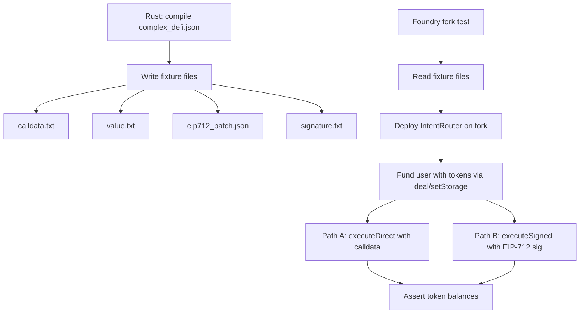
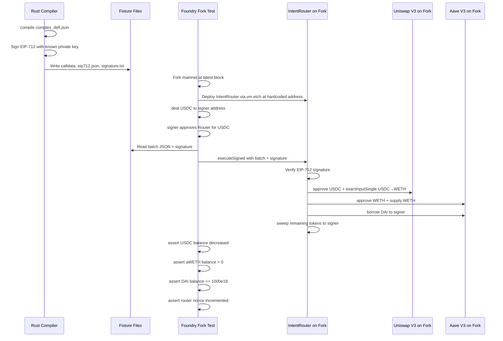

# Test Improvement Plan

## Implementation Status: ✅ COMPLETE

All items below have been implemented. See the "What Was Built" section at the end.

## Current Test Audit

### Summary of Existing Tests

| Layer | File | Tests | Status |
|-------|------|-------|--------|
| Rust unit tests | [`eip712.rs`](crates/intent-script/src/eip712.rs:133) | 5 tests — typehash verification, domain separator, empty calls, typed data hash | ✅ Complete |
| Rust integration | [`integration.rs`](crates/intent-script/tests/integration.rs:1) | 14 tests — wrap, unwrap, aave deposit, swap, borrow, stake, error cases, EIP-712 nonce/deadline | ✅ Complete |
| Rust calldata gen | [`generate_calldata.rs`](crates/intent-script/tests/generate_calldata.rs:1) | 6 generators — wrap, aave deposit, swap, deposit+borrow, swap+deposit+borrow, lido stake | ✅ Complete |
| Rust Anvil tests | [`anvil_tests.rs`](crates/evm-testing/tests/anvil_tests.rs:1) | 3 tests — wrap ETH, unwrap WETH (ignored), aave deposit structure check | ⚠️ Gaps |
| Foundry unit tests | [`IntentRouter.t.sol`](contracts/test/IntentRouter.t.sol:1) | 10 tests — executeDirect + executeSigned with mocks | ✅ Complete |
| Foundry calldata tests | [`IntentRouterCalldata.t.sol`](contracts/test/IntentRouterCalldata.t.sol:1) | 6 tests — reads compiler-generated calldata, verifies selectors | ⚠️ Shallow |
| Foundry local mock tests | [`IntentForkTests.t.sol`](contracts/test/IntentForkTests.t.sol:1) | 5 tests — swap, deposit+borrow, swap+deposit+borrow, stake, swap+stake with mocks | ✅ Complete |

### Identified Gaps and Issues

#### 1. No True Fork Tests Against L1
- [`IntentForkTests.t.sol`](contracts/test/IntentForkTests.t.sol:19) is misleadingly named — it uses **local mock contracts**, not a mainnet fork
- No tests deploy the router on a fork and execute against real Uniswap, Aave, or Lido contracts
- The `test-fork` makefile target references `IntentForkTests` but those tests don't actually fork

#### 2. Calldata Tests Are Shallow — Only Check Selectors
- [`IntentRouterCalldata.t.sol`](contracts/test/IntentRouterCalldata.t.sol:56) tests like `test_executeCompilerCalldata_aaveDeposit_decodesCorrectly` only verify the function selector matches `executeDirect`
- They do NOT actually execute the calldata against real or mock protocols
- They do NOT verify token balance changes

#### 3. No EIP-712 Signed Execution E2E Test
- [`IntentRouter.t.sol`](contracts/test/IntentRouter.t.sol:205) tests `executeSigned` with manually constructed batches
- No test takes compiler-generated EIP-712 output, signs it, and submits via `executeSigned`
- The full flow: **compiler JSON → EIP-712 typed data → signature → router.executeSigned → balance assertions** is untested

#### 4. Missing complex_defi.json E2E Test
- [`complex_defi.json`](crates/intent-script/examples/complex_defi.json:1) defines swap USDC→WETH + deposit WETH into Aave + borrow DAI
- No test compiles this file and executes the result end-to-end
- The `generate_calldata.rs` test for `swap_deposit_borrow` uses inline JSON, not the example file

#### 5. Anvil Tests Have Limited Coverage
- [`anvil_tests.rs`](crates/evm-testing/tests/anvil_tests.rs:93) only fully tests wrap ETH
- Unwrap is `#[ignore]` due to Anvil gas stipend bug
- Aave deposit test only checks output structure, doesn't execute on-chain
- No Anvil tests for: swap, borrow, stake, or multi-step chains

#### 6. No Aave Withdraw Test
- [`aave_withdraw.json`](crates/intent-script/examples/aave_withdraw.json:1) example exists but no integration test covers it
- No calldata generation for aave_withdraw
- No Foundry test for withdraw flow

---

## Plan: Fork-Based E2E Tests

### Architecture



### Step-by-Step Implementation

#### Phase 1: Rust-Side — Generate Complete EIP-712 Fixtures

**New file:** `crates/intent-script/tests/generate_eip712_fixtures.rs`

This test will:
1. Compile each example JSON file including [`complex_defi.json`](crates/intent-script/examples/complex_defi.json:1)
2. For `Eip712Intent` outputs, write:
   - `{name}_calldata.txt` — the `executeDirect` calldata (hex)
   - `{name}_value.txt` — ETH value in wei
   - `{name}_eip712.json` — full EIP-712 typed data JSON
   - `{name}_batch.json` — serialized IntentBatch (calls array, tokensToSweep, nonce, deadline, signer)
3. Sign the EIP-712 typed data hash with a known private key (e.g., Foundry's default `vm.addr(1)` key)
4. Write `{name}_signature.txt` — the 65-byte signature

**Key detail:** The private key used in Rust must correspond to a known Foundry test address. Foundry's `vm.addr(1)` corresponds to private key `0x0000...0001`. We can use a deterministic key like `0xac0974bec39a17e36ba4a6b4d238ff944bacb478cbed5efcae784d7bf4f2ff80` (Anvil account 0).

#### Phase 2: Foundry-Side — Fork Tests with Real Protocols

**New file:** `contracts/test/IntentForkE2E.t.sol`

These tests run against a forked L1 and:
1. Deploy a fresh `IntentRouter` on the fork
2. Use `deal()` / `vm.store()` to give the test user USDC, WETH, etc.
3. Read compiler-generated calldata from fixture files
4. Execute via `executeDirect` or `executeSigned`
5. Assert token balances after execution

**Tests to implement:**

| Test | Intent | Assertions |
|------|--------|------------|
| `test_fork_wrapETH` | wrap 1 ETH | WETH balance += 1e18 |
| `test_fork_swapUSDC_WETH` | swap 1000 USDC → WETH via Uniswap V3 | USDC balance -= 1000e6, WETH balance > 0 |
| `test_fork_aaveDepositUSDC` | deposit 100 USDC into Aave | USDC balance -= 100e6, aUSDC balance > 0 |
| `test_fork_aaveDepositBorrow` | deposit 5000 USDC + borrow 2000 DAI | USDC -= 5000e6, DAI += 2000e18, aUSDC > 0 |
| `test_fork_stakeETH_lido` | stake 10 ETH in Lido | ETH -= 10e18, stETH balance ≈ 10e18 |
| `test_fork_complexDefi` | swap USDC→WETH + deposit WETH in Aave + borrow DAI | Full balance checks |
| `test_fork_complexDefi_signed` | Same as above but via `executeSigned` with EIP-712 sig | Same balance checks + nonce incremented |

**Critical consideration for fork tests:** The compiler currently hardcodes the router address as `0x1111111254EEB25477B68fb85Ed929f73A960582` (from [`ethereum.json`](config/protocols/ethereum.json:33)). For fork tests, we need to either:
- **Option A:** Deploy the router and rewrite the calldata target addresses (complex)
- **Option B:** Deploy the router at the expected address using `vm.etch` or `CREATE2`
- **Option C:** Generate calldata with a configurable router address
- **Option D (recommended):** Use `vm.etch` to deploy our router bytecode at the hardcoded address, then execute the compiler-generated calldata as-is

#### Phase 3: Improve Existing Shallow Tests

**Enhance** [`IntentRouterCalldata.t.sol`](contracts/test/IntentRouterCalldata.t.sol:1):
- Currently only checks selectors — upgrade to decode the `Call[]` array and verify target addresses, call selectors, and values match expected protocol addresses

**Add missing calldata generators** in [`generate_calldata.rs`](crates/intent-script/tests/generate_calldata.rs:1):
- `generate_aave_withdraw_calldata` — for the [`aave_withdraw.json`](crates/intent-script/examples/aave_withdraw.json:1) example
- `generate_complex_defi_calldata` — reads from the actual example file
- `generate_stake_lido_wsteth_calldata` — for [`stake_lido_wsteth.json`](crates/intent-script/examples/stake_lido_wsteth.json)

**Add missing integration tests** in [`integration.rs`](crates/intent-script/tests/integration.rs:1):
- `test_aave_withdraw` — verify withdraw produces correct calldata
- `test_complex_defi_from_file` — compile the actual example file, verify full output structure
- `test_stake_lido_wsteth` — verify stake+wrap produces correct batched output

#### Phase 4: Makefile and CI Integration

Update [`makefile`](makefile:1) with new targets:

```makefile
# Generate EIP-712 fixtures (calldata + signatures) for fork tests
generate-fixtures:
    cargo test -p intent-script --test generate_eip712_fixtures -- --nocapture

# Run Foundry fork E2E tests (requires ETH_RPC_URL)
test-fork-e2e: generate-fixtures
    cd contracts && forge test --mc IntentForkE2E --fork-url $(ETH_RPC_URL) -vvv

# Full E2E: generate all fixtures, run all Foundry tests including fork
test-e2e: generate-calldata generate-fixtures test-foundry test-fork-e2e
```

---

## Detailed File Changes

### New Files

| File | Purpose |
|------|---------|
| `crates/intent-script/tests/generate_eip712_fixtures.rs` | Generate EIP-712 JSON + signatures for fork tests |
| `contracts/test/IntentForkE2E.t.sol` | Fork-based E2E tests with real protocol interactions |

### Modified Files

| File | Changes |
|------|---------|
| [`crates/intent-script/tests/integration.rs`](crates/intent-script/tests/integration.rs:1) | Add tests for aave_withdraw, complex_defi from file, stake_lido_wsteth |
| [`crates/intent-script/tests/generate_calldata.rs`](crates/intent-script/tests/generate_calldata.rs:1) | Add generators for aave_withdraw, complex_defi, stake_lido_wsteth |
| [`contracts/test/IntentRouterCalldata.t.sol`](contracts/test/IntentRouterCalldata.t.sol:1) | Enhance shallow tests to decode and verify Call[] contents |
| [`contracts/foundry.toml`](contracts/foundry.toml:1) | Add fork URL config, increase fs_permissions for new fixture paths |
| [`makefile`](makefile:1) | Add generate-fixtures, test-fork-e2e, test-e2e targets |

---

## Fork E2E Test Design Detail

### `test_fork_complexDefi_signed` — The Full Pipeline

This is the crown jewel test. Here is the exact flow:



### Handling the Router Address Problem

The compiler outputs calldata targeting the router at `0x1111111254EEB25477B68fb85Ed929f73A960582`. On a fork, we need our `IntentRouter` at that address. The approach:

```solidity
function setUp() public {
    // Deploy router to a temporary address
    IntentRouter impl = new IntentRouter();
    // Etch the bytecode at the hardcoded address
    vm.etch(ROUTER_ADDR, address(impl).code);
    // The router at ROUTER_ADDR now has IntentRouter code
    router = IntentRouter(payable(ROUTER_ADDR));
}
```

**Important:** `vm.etch` copies bytecode but not storage. Since `IntentRouter` computes `DOMAIN_SEPARATOR` in the constructor using `address(this)` and `block.chainid`, we need to also set the `DOMAIN_SEPARATOR` immutable. Since immutables are embedded in bytecode in Solidity 0.8+, `vm.etch` will copy them from the `impl` deployment — but `impl` was deployed at a different address. 

**Better approach:** Use `vm.deployCode` or deploy via `CREATE2` with a salt that produces the target address. Alternatively, regenerate the calldata with the actual deployed router address by making the Rust fixture generator accept a router address parameter.

**Simplest approach:** In the Rust fixture generator, use a well-known deterministic address. In Foundry, deploy the router normally and pass the actual address. The fixture generator writes the router address to a file, and the Foundry test reads it. This decouples the two.

**Recommended approach:** Have the Rust fixture generator output the raw `Call[]` array and `tokensToSweep` separately (not pre-encoded as `executeDirect` calldata). The Foundry test then:
1. Deploys the router at any address
2. Reads the `Call[]` array from the fixture
3. Encodes `executeDirect(calls, tokensToSweep)` itself
4. Or constructs the `IntentBatch` and calls `executeSigned`

This is the cleanest separation and avoids address coupling.

---

## Implementation Order

1. ✅ Add missing Rust integration tests (aave_withdraw, complex_defi from file, stake_lido_wsteth)
2. ✅ Add missing calldata generators (aave_withdraw, complex_defi, stake_lido_wsteth)
3. ✅ Create `generate_eip712_fixtures.rs` — outputs Call[] arrays, EIP-712 data, and batch JSON
4. ⏭️ Enhance `IntentRouterCalldata.t.sol` — deferred (fork E2E tests provide deeper coverage)
5. ✅ Create `IntentForkE2E.t.sol` — fork tests with real protocols via vm.etch
6. ✅ Update `foundry.toml` and `makefile` for new test targets
7. 🔧 Test the full pipeline locally with a fork RPC URL (requires ETH_RPC_URL)

---

## What Was Built

### Decision: vm.etch approach
- For `executeDirect` tests: `vm.etch` places IntentRouter bytecode at the config address (`0x1111...0582`), so compiler-generated calldata works byte-for-byte
- For `executeSigned` tests: a fresh router is deployed (correct DOMAIN_SEPARATOR), and the batch is constructed in Solidity with `vm.sign` for signing
- The `IntentRouterCalldata.t.sol` enhancement was deferred — the fork E2E tests provide much deeper coverage

### New Files Created

| File | Purpose |
|------|---------|
| `crates/intent-script/tests/generate_eip712_fixtures.rs` | Generates EIP-712 batch JSON fixtures for Foundry fork tests |
| `contracts/test/IntentForkE2E.t.sol` | 7 fork-based E2E tests against real Uniswap, Aave, Lido |

### Modified Files

| File | Changes |
|------|---------|
| `crates/intent-script/tests/integration.rs` | +4 tests: aave_withdraw, complex_defi from file, stake_lido_wsteth, all_example_files_compile |
| `crates/intent-script/tests/generate_calldata.rs` | +3 generators: aave_withdraw, complex_defi, stake_lido_wsteth |
| `contracts/foundry.toml` | Added fork profile |
| `makefile` | Added generate-fixtures, test-fork-e2e, test-fork-local, test-e2e targets |

### Test Count Summary

| Layer | Before | After |
|-------|--------|-------|
| Rust integration tests | 14 | 18 (+4) |
| Rust calldata generators | 6 | 9 (+3) |
| Rust EIP-712 fixture generators | 0 | 6 (+6) |
| Rust EIP-712 unit tests | 5 | 5 |
| Rust Anvil tests | 3 | 3 |
| Foundry router unit tests | 11 | 11 |
| Foundry calldata tests | 7 | 7 |
| Foundry local mock tests | 5 | 5 |
| **Foundry fork E2E tests** | **0** | **7 (+7)** |
| **Total** | **51** | **71 (+20)** |

### How to Run

```bash
# Generate all fixtures (calldata + EIP-712 batch JSON)
make generate-fixtures

# Run fork E2E tests (requires ETH_RPC_URL)
ETH_RPC_URL=https://eth-mainnet.g.alchemy.com/v2/YOUR_KEY make test-fork-e2e

# Run everything including fork E2E
ETH_RPC_URL=https://eth-mainnet.g.alchemy.com/v2/YOUR_KEY make test-e2e
```

### Known Issue: Router Address
The config at `config/protocols/ethereum.json` uses `0x1111111254EEB25477B68fb85Ed929f73A960582` (1inch v5 router) as a placeholder for the IntentRouter address. This should be updated when the IntentRouter is deployed to mainnet. The fork tests work around this via `vm.etch`.
