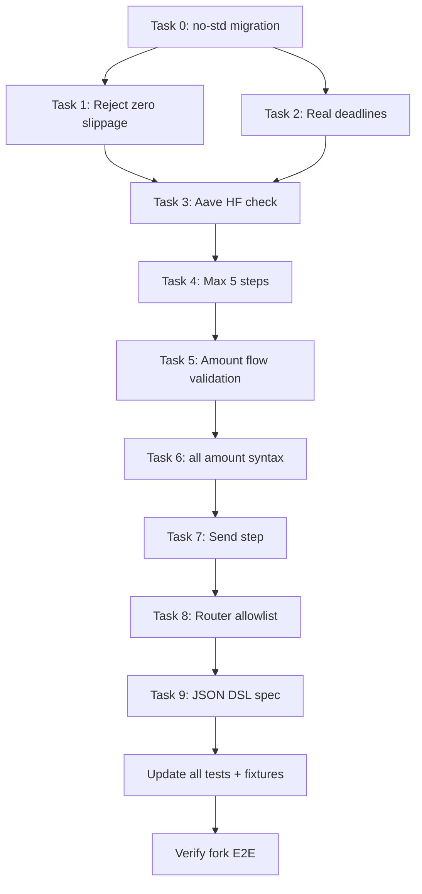

# IntentOS V1 MVP — Implementation Plan

> **Context for implementors:** This plan is self-contained. It describes the current state of the codebase, what needs to change, and exactly how to change it. Each task has one concrete approach with specific file paths, code snippets, and test requirements. The project is a Rust compiler that transforms JSON intent descriptions into unsigned EVM transactions. The codebase lives at `crates/intent-script/` (Rust) and `contracts/` (Solidity/Foundry).

---

## Current State

### What Works
- **Compiler pipeline:** Parse → Normalize → Validate → Enrich → Lower → Plan → Build
- **Protocols:** Aave V3 (supply/borrow/withdraw), Uniswap V3 (exactInputSingle), Lido (stake/wstETH wrap), WETH (wrap/unwrap), 1inch (calldata passthrough)
- **Router:** `IntentRouter.sol` with `executeDirect()` + `executeSigned()` (EIP-712)
- **Auto-insertion:** `transferFrom`, `approve`, token sweeps handled by enricher
- **Tests:** 35 Rust tests + 23 Foundry tests (7 fork E2E against mainnet)
- **Config:** Ethereum mainnet fully configured (assets + protocols)

### What's Missing
| # | Gap | Risk |
|---|-----|------|
| 1 | Swaps allow `amount_out_minimum = 0` | 100% sandwich attack |
| 2 | Swap deadline is `U256::MAX`, EIP-712 deadline can be 0 | Stale execution, replay |
| 3 | No Aave health factor check | Liquidation risk |
| 4 | No step count limit | Unbounded complexity |
| 5 | No cross-step amount flow validation | Silent failures |
| 6 | No `"all"` amount syntax | Poor UX for chained steps |
| 7 | No `send` step | Can't transfer tokens |
| 8 | Router calls any contract | Arbitrary code execution |
| 9 | Library uses `std` (file I/O, SystemTime) | Not embeddable in WASM/no-std |

### Architecture Reference

```
crates/intent-script/src/
├── lib.rs                  # Public API: compile(json, config_dir)
├── main.rs                 # CLI binary
├── schema/public_ast.rs    # JSON input types (serde)
├── ir/canonical.rs         # Internal representation (ResolvedStep, etc.)
├── compiler/
│   ├── mod.rs              # Pipeline orchestration
│   ├── normalize.rs        # Stage B: aliases → addresses, amounts → U256
│   ├── validate.rs         # Stage C: validation rules
│   ├── enrich.rs           # Stage D: insert transferFrom, approve, sweeps
│   ├── lower.rs            # Stage E: IR → concrete EVM calls
│   ├── plan.rs             # Stage F: execution strategy
│   └── build.rs            # Stage G: final tx building + EIP-712
├── adapters/               # Protocol-specific calldata encoders
├── registry/loader.rs      # Config file loading
├── eip712.rs               # EIP-712 hashing
├── error.rs                # Error types
└── output.rs               # Output types + JSON serialization

contracts/src/
└── IntentRouter.sol        # On-chain batch executor
```

---

## Task 0: no-std Migration for the Compiler Library

**Files:** `Cargo.toml`, `lib.rs`, `error.rs`, `registry/loader.rs`, `compiler/mod.rs`, `eip712.rs`, all files using `std::collections`

**Problem:** The library uses `std::path::Path`, `std::fs`, `std::io::Error`, `std::sync::LazyLock`, and `std::collections::HashMap/HashSet`. This prevents embedding in WASM or no-std environments.

**Approach:** Split the crate into a no-std library and a std binary. The library accepts pre-loaded config data (strings) instead of file paths.

### Exact changes:

**A. Cargo.toml** — add `no_std` support with a `std` feature flag:
```toml
[features]
default = ["std"]
std = ["serde_json/std", "thiserror/std"]

[dependencies]
alloy-primitives = { version = "1", default-features = false }
alloy-sol-types = { version = "1", default-features = false }
serde = { version = "1", default-features = false, features = ["derive", "alloc"] }
serde_json = { version = "1", default-features = false, features = ["alloc"] }
thiserror = { version = "2", default-features = false }
hashbrown = "0.15"          # no-std HashMap/HashSet
clap = { version = "4", features = ["derive"], optional = true }

[dependencies.clap]
optional = true  # only for the binary

[[bin]]
name = "intent-script"
required-features = ["std"]
```

**B. lib.rs** — add `#![no_std]` with `extern crate alloc`:
```rust
#![no_std]
extern crate alloc;
```

**C. Replace `std::collections`** everywhere:
- `std::collections::HashMap` → `hashbrown::HashMap`
- `std::collections::HashSet` → `hashbrown::HashSet`
- `use alloc::vec::Vec`, `use alloc::string::String`, `use alloc::format`

**D. Refactor `RegistryContext::load()`** — change from file-path-based to data-based:
```rust
// Before:
pub fn load(config_dir: &Path, network: &str) -> Result<Self>

// After:
pub fn load(
    chains_json: &str,
    assets_json: &str,
    protocols_json: &str,
    network: &str,
) -> Result<Self>
```
Remove all `std::fs::read_to_string` calls. The caller (CLI binary) reads files and passes strings.

**E. Refactor `compile()` public API**:
```rust
// Before:
pub fn compile(json_input: &str, config_dir: &Path) -> Result<CompileResult>

// After:
pub fn compile(json_input: &str, chains_json: &str, assets_json: &str, protocols_json: &str) -> Result<CompileResult>
```

**F. Move file I/O to `main.rs`** — the CLI binary reads config files and calls the new API.

**G. `eip712.rs`** — replace `std::sync::LazyLock` with `once_cell::race::OnceBox` (no-std compatible) or just compute the type hashes inline (they're constant keccak256 values — can be `const` byte arrays).

**H. `error.rs`** — remove `Io(#[from] std::io::Error)`. Add a generic `Config(String)` variant for config loading errors. The CLI can map `io::Error` to `CompileError::Config` before calling the library.

**Test updates:** All tests that call `compile(json, &config_dir())` need updating to load config files first and pass strings. Create a test helper:
```rust
fn load_config() -> (String, String, String) {
    let dir = config_dir();
    let chains = std::fs::read_to_string(dir.join("chains.json")).unwrap();
    let assets = std::fs::read_to_string(dir.join("assets/ethereum.json")).unwrap();
    let protocols = std::fs::read_to_string(dir.join("protocols/ethereum.json")).unwrap();
    (chains, assets, protocols)
}
```

---

## Task 1: Reject Swaps Without Slippage Protection

**File:** `crates/intent-script/src/compiler/validate.rs`

**Problem:** Swaps with `amount_out_minimum == 0` are vulnerable to 100% sandwich attacks.

**Exact change:** Add after `validate_asset_compatibility(step)?;` in the step loop:

```rust
fn validate_slippage(step: &ResolvedStep) -> Result<()> {
    if let ResolvedStep::UniswapV3Swap { amount_out_minimum, .. } = step {
        if *amount_out_minimum == U256::ZERO {
            return Err(CompileError::InvalidChain(
                "Swap has no slippage protection (amountOutMinimum = 0). \
                 Provide 'min_amount_out' or 'price' + 'slippage' on the swap step."
                    .to_string(),
            ));
        }
    }
    Ok(())
}
```

**Tests:** Update all integration tests with swaps to include `"min_amount_out"`. Add a test that omits it and expects an error.

---

## Task 2: Enforce Real Deadlines (Swap + EIP-712)

**Files:** `public_ast.rs`, `normalize.rs`, `compiler/mod.rs`, `IntentRouter.sol`

**Problem:** Swap deadline is `U256::MAX`. EIP-712 deadline can be 0 (no expiry).

**Approach:** `current_timestamp` is a field in the JSON input. The compiler uses it to compute default deadlines. No `SystemTime::now()` in the library.

### Changes:

**A. Schema** — add to `IntentScript` in `public_ast.rs`:
```rust
/// Current Unix timestamp in seconds. Required for deadline computation.
/// The caller (CLI/frontend) provides this.
#[serde(default)]
pub current_timestamp: Option<u64>,
```

Add to `SwapStep`:
```rust
/// Optional swap-specific deadline as Unix timestamp.
#[serde(default)]
pub deadline: Option<u64>,
```

**B. Constants** in `normalize.rs`:
```rust
const DEFAULT_SWAP_DEADLINE_SECS: u64 = 1200;  // 20 minutes
const DEFAULT_INTENT_DEADLINE_SECS: u64 = 1800; // 30 minutes
```

**C. Compute effective intent deadline** in `normalize()`:
```rust
let effective_deadline = match script.deadline {
    Some(d) if d > 0 => d,
    _ => match script.current_timestamp {
        Some(ts) => ts + DEFAULT_INTENT_DEADLINE_SECS,
        None => 0, // backward compat when no timestamp provided
    },
};
```

**D. Compute swap deadline** — replace `deadline: U256::MAX` in Uniswap normalization:
```rust
let swap_deadline = match s.deadline {
    Some(d) => d,
    None => {
        if effective_deadline > 0 {
            effective_deadline
        } else {
            match script.current_timestamp {
                Some(ts) => ts + DEFAULT_SWAP_DEADLINE_SECS,
                None => u64::MAX, // backward compat
            }
        }
    }
};
// Use: deadline: U256::from(swap_deadline)
```

**E. Solidity** — in `IntentRouter.sol`, change line 77:
```solidity
require(batch.deadline > 0 && block.timestamp <= batch.deadline, "Expired or missing deadline");
```

**F. CLI** — in `main.rs`, inject `current_timestamp` into the JSON before compiling (or document that the frontend must provide it).

**Tests:** Update Foundry `executeSigned` tests to use non-zero deadlines. Update Rust tests to include `"current_timestamp"` in JSON.

---

## Task 3: Aave Health Factor Safety Check

**File:** `crates/intent-script/src/compiler/validate.rs`

**Exact change:**

```rust
const MIN_HEALTH_FACTOR: f64 = 1.2;
const WARN_HEALTH_FACTOR: f64 = 1.5;

fn validate_health_factor(
    balances: Option<&ResolvedBalances>,
    warnings: &mut Vec<String>,
) -> Result<()> {
    if let Some(b) = balances {
        if let Some(hf) = b.aave_health_factor {
            if hf < MIN_HEALTH_FACTOR {
                return Err(CompileError::InvalidChain(format!(
                    "Aave health factor is {:.2}, below minimum {:.1}. \
                     Borrow rejected to prevent liquidation.",
                    hf, MIN_HEALTH_FACTOR
                )));
            }
            if hf < WARN_HEALTH_FACTOR {
                warnings.push(format!(
                    "Aave health factor is {:.2}. Borrowing may increase liquidation risk.", hf
                ));
            }
        }
    }
    Ok(())
}
```

Call from the `AaveV3Borrow` match arm, after `validate_borrow_feasibility()`.

**Tests:** 3 new unit tests: HF < 1.2 → error, HF 1.2-1.5 → warning, HF > 1.5 → clean.

---

## Task 4: Max Step Count

**File:** `crates/intent-script/src/compiler/validate.rs`

```rust
pub const MAX_STEPS: usize = 5;

// In validate(), after empty-steps check:
if intent.steps.len() > MAX_STEPS {
    return Err(CompileError::Validation(format!(
        "Intent has {} steps but maximum is {}", intent.steps.len(), MAX_STEPS
    )));
}
```

**Tests:** 1 test with 6 steps → error.

---

## Task 5: Cross-Step Amount Flow Validation

**File:** `crates/intent-script/src/compiler/validate.rs`

**Design:** Track tokens produced by previous steps. Only validate consumption when a step uses a token that a prior step produced. Wallet-sourced tokens are not checked.

```rust
fn validate_amount_flow(steps: &[ResolvedStep]) -> Result<()> {
    let mut produced: HashMap<Address, U256> = HashMap::new();

    for (i, step) in steps.iter().enumerate() {
        if let Some((token, required)) = step_consumes(step) {
            if let Some(available) = produced.get(&token) {
                if required > *available {
                    return Err(CompileError::InvalidChain(format!(
                        "Step {} requires {} of token {} but previous steps only guarantee {}",
                        i + 1, required, token, available
                    )));
                }
                produced.insert(token, *available - required);
            }
        }
        if let Some((token, guaranteed)) = step_produces(step) {
            *produced.entry(token).or_insert(U256::ZERO) += guaranteed;
        }
    }
    Ok(())
}

fn step_consumes(step: &ResolvedStep) -> Option<(Address, U256)> {
    match step {
        ResolvedStep::AaveV3Supply { asset, amount, .. } => Some((*asset, *amount)),
        ResolvedStep::WstETHWrap { steth, amount, .. } => Some((*steth, *amount)),
        ResolvedStep::UniswapV3Swap { token_in, amount_in, .. } => Some((*token_in, *amount_in)),
        _ => None,
    }
}

fn step_produces(step: &ResolvedStep) -> Option<(Address, U256)> {
    match step {
        ResolvedStep::UniswapV3Swap { token_out, amount_out_minimum, .. } => Some((*token_out, *amount_out_minimum)),
        ResolvedStep::AaveV3Borrow { asset, amount, .. } => Some((*asset, *amount)),
        ResolvedStep::LidoStake { lido, amount, .. } => Some((*lido, *amount)),
        ResolvedStep::Wrap { wrapped_token, amount, .. } => Some((*wrapped_token, *amount)),
        _ => None,
    }
}
```

Call `validate_amount_flow(&intent.steps)?;` at the end of `validate()`.

**Tests:** swap→deposit where deposit > swap min_out → error; swap→deposit where deposit <= min_out → ok; standalone deposit → ok.

---

## Task 6: "all" Amount Syntax

**Files:** `normalize.rs`

**Design:** Resolve `"all"` at normalization time to the previous step's guaranteed output. The IR stays unchanged (all amounts are `U256`). Excess tokens get swept back to the user.

**Exact change:** Add a helper:

```rust
fn resolve_amount_or_all(
    amount_str: &str,
    decimals: u8,
    token: Address,
    previous_steps: &[ResolvedStep],
) -> Result<U256> {
    if amount_str == "all" {
        for step in previous_steps.iter().rev() {
            if let Some((produced_token, guaranteed)) = step_produces(step) {
                if produced_token == token {
                    if guaranteed == U256::ZERO {
                        return Err(CompileError::InvalidChain(
                            "Cannot use 'all': previous step has zero guaranteed output".into(),
                        ));
                    }
                    return Ok(guaranteed);
                }
            }
        }
        return Err(CompileError::InvalidChain(
            "Cannot use 'all': no previous step produces this token".into(),
        ));
    }
    parse_amount(amount_str, decimals)
}
```

Use `step_produces()` from Task 5 (extract to a shared location, e.g., `ir/canonical.rs` or a new `ir/flow.rs`).

Replace `parse_amount(&d.amount, decimals)?` calls in each step normalization branch with `resolve_amount_or_all(&d.amount, decimals, asset, &steps)?`. Thread `&steps` (already-normalized steps) into `normalize_step()`.

**Tests:** swap→deposit with `"all"` → resolves to min_amount_out; `"all"` on first step → error; `"all"` with wrong token → error.

---

## Task 7: Send Step (ERC20, ERC721, ETH)

**Files:** `public_ast.rs`, `canonical.rs`, `normalize.rs`, `enrich.rs`, `validate.rs`, new `adapters/send.rs`, `adapters/mod.rs`

### Schema in `public_ast.rs`:

Add `Send(SendStep)` to `Step` enum.

```rust
#[derive(Debug, Deserialize)]
pub struct SendStep {
    #[serde(default)]
    pub asset: Option<String>,       // ERC20/ETH token alias
    #[serde(default)]
    pub amount: Option<String>,      // human-readable amount
    pub to: String,                  // recipient address
    #[serde(default)]
    pub asset_type: Option<String>,  // "erc20" (default), "erc721"
    #[serde(default)]
    pub contract: Option<String>,    // NFT contract address (erc721 only)
    #[serde(default)]
    pub token_id: Option<String>,    // NFT token ID (erc721 only)
}
```

### IR variants in `canonical.rs`:

```rust
SendErc20 { token: Address, to: Address, amount: U256 },
SendEth { to: Address, amount: U256 },
SendErc721 { contract: Address, from: Address, to: Address, token_id: U256 },
```

### Normalization in `normalize.rs`:

Dispatch based on `asset_type` and `asset`:
- `asset_type == "erc721"` → require `contract` + `token_id` → `SendErc721`
- `asset == "ETH"` → require `amount` → `SendEth`
- Otherwise → require `asset` + `amount` → `SendErc20`

### Enrichment in `enrich.rs`:

- `SendErc20`: if batching and token not in router → insert `Erc20TransferFrom(user, router, amount)`. Push step.
- `SendErc20`: if token IS in router → just push step (no transferFrom).
- `SendEth`: push as-is (ETH sent as msg.value).
- `SendErc721`: push as-is with `from: signer` (user must approve router for NFT).

### Adapter in new `adapters/send.rs`:

```rust
sol! {
    function transfer(address to, uint256 amount) external returns (bool);
    function safeTransferFrom(address from, address to, uint256 tokenId) external;
}
```

- `lower_send_erc20` → `transfer(to, amount)`, target = token, value = 0
- `lower_send_eth` → empty calldata, target = recipient, value = amount
- `lower_send_erc721` → `safeTransferFrom(from, to, tokenId)`, target = contract, value = 0

### Validation:

- Add `SendErc20`/`SendEth` to `validate_amount()` (zero amount check)
- Add all send variants to `validate_asset_compatibility()`: reject `to == Address::ZERO`
- Add `SendErc20` to `step_consumes()` in Task 5

### Wire into `adapters/mod.rs`:

```rust
pub mod send;
ResolvedStep::SendErc20 { .. } => send::lower_send_erc20(step),
ResolvedStep::SendEth { .. } => send::lower_send_eth(step),
ResolvedStep::SendErc721 { .. } => send::lower_send_erc721(step),
```

**Tests:** Send USDC, send ETH, send ERC721, send 0 → error, send to zero address → error, swap→send all.

---

## Task 8: Router Contract Allowlist

**File:** `contracts/src/IntentRouter.sol`, Foundry tests

### Solidity changes:

```solidity
address public owner;
mapping(address => bool) public allowedTargets;

modifier onlyOwner() {
    require(msg.sender == owner, "Not owner");
    _;
}

constructor() {
    owner = msg.sender;
    // ... existing DOMAIN_SEPARATOR ...
}

function setAllowedTarget(address target, bool allowed) external onlyOwner {
    allowedTargets[target] = allowed;
}

function setAllowedTargets(address[] calldata targets, bool allowed) external onlyOwner {
    for (uint256 i = 0; i < targets.length; i++) {
        allowedTargets[targets[i]] = allowed;
    }
}
```

In `_executeCalls()`, add at top of loop:
```solidity
require(allowedTargets[calls[i].target], "Target not allowed");
```

### Foundry test updates:

Every test `setUp()` must whitelist contracts used. Add test for non-allowed target → revert.

---

## Task 9: JSON DSL Specification

**File:** New `plans/json-dsl-spec.md`

Write a complete specification of the JSON intent DSL covering all step types, field requirements, amount syntax, and examples mapping natural language to JSON. (See separate document.)

---

## Implementation Order



**Phase 1** (Task 0): no-std migration — foundational change that affects the public API.
**Phase 2** (Tasks 1-4): Validation hardening — safety guards.
**Phase 3** (Tasks 5-6): Amount flow — cross-step validation + `"all"` syntax.
**Phase 4** (Task 7): Send step — new feature across the full stack.
**Phase 5** (Task 8): Router allowlist — Solidity safety.
**Phase 6** (Task 9): DSL spec — documentation.
**Phase 7**: Test updates, fixture regeneration, fork E2E verification.

---

## Files Changed Summary

| File | Tasks | Type |
|------|-------|------|
| `Cargo.toml` | 0 | Modified |
| `lib.rs` | 0 | Modified |
| `error.rs` | 0 | Modified |
| `registry/loader.rs` | 0 | Modified |
| `compiler/mod.rs` | 0, 2 | Modified |
| `main.rs` | 0, 2 | Modified |
| `validate.rs` | 1, 3, 4, 5, 7 | Modified |
| `normalize.rs` | 2, 6, 7 | Modified |
| `public_ast.rs` | 2, 7 | Modified |
| `canonical.rs` | 7 | Modified |
| `enrich.rs` | 7 | Modified |
| `eip712.rs` | 0 | Modified |
| `adapters/send.rs` | 7 | New |
| `adapters/mod.rs` | 7 | Modified |
| `IntentRouter.sol` | 2, 8 | Modified |
| `integration.rs` | All | Modified |
| Foundry tests | 2, 8 | Modified |
| `plans/json-dsl-spec.md` | 9 | New |
